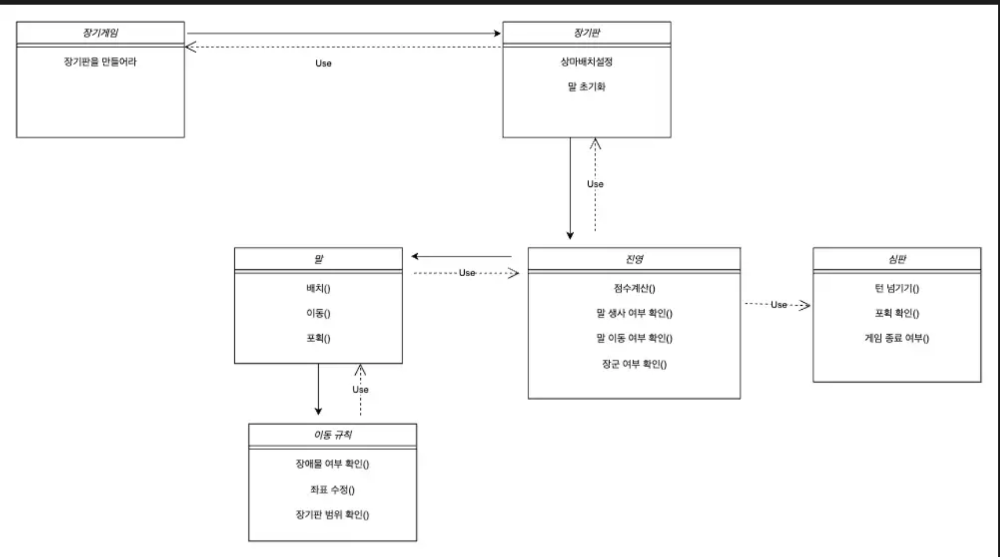

# java-janggi

장기 미션 저장소

---

1. UML 다이어그램

- 초기 설계 구상으로, 실제 구현과 다소 차이가 있을 수 있습니다.

---

2. 플로우 차트

- [x] 입력: 사용자로부터 초한 순으로 상차림을 입력받는다
- [x] 출력: 장기 말들이 초기화된 장기 보드를 출력한다
- [x] 입력: 움직일 팀 이름을 입력받는다
- [x] 입력: 움직이고자 하는 기물 이름과 기물의 시작 좌표를 입력받는다
- [x] 검증: 해당 팀에 해당 말의 이름과 시작 좌표가 맞는지 확인한다
- [x] 입력: 움직이고자 하는 기물의 도착 좌표를 입력받는다
- [x] 검증: 도착 좌표에 우리 팀의 말이 있는지 확인한다
- [x] 검증: 이동하고자 하는 경로의 좌표들에 장애물이 있는지 확인한다
- [x] 출력: 새롭게 이동한 기물의 좌표가 반영된 장기 보드를 출력한다

---

3. 기능 구현 목록

- [1] 장기 게임
  - [ ] 장기 게임 제어
  - [ ] 장기 게임 점수 계산
  - [ ] 턴 넘기기 및 반복 실행
- [2] 장기 판
  - [x] 상차림 설정
  - [x] 진영에 따른 말 초기화
  - [x] 장기 진영별 말 위치, 이동 관련 검증
  - [ ] 장기 판 밖으로의 이동 검증
  - [ ] 장기 말의 이동 규칙 적용 검증
  - [ ] 장군 여부에 따른 이동 가능 여부 검증
- [3] 장기 말 경로 내비게이터
  - [x] 시작 좌표와 도착 좌표 사이의 경로 좌표 반환
- [3] 말
  - [x] 위치 이동
  - [x] 차지 여부 확인
  - [ ] 생사 여부 확인
  - [ ] 이동 규칙 저장
- [4] 위치
  - 좌표 값(x, y) 저장

- 테스트는 향후 추가할 예정입니다.
---
