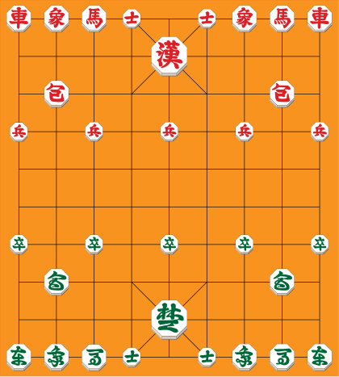

# java-janggi

장기 미션 저장소

## 과제 진행 요구 사항

### 게임판

- 9행, 10열 크기의 게임판을 만든다.
- 궁(宮) 또는 궁성(宮城)의 영역은 고려하지 않는다.
    - 가로, 세로 이동만 고려한다.

### 장기 기물

- 장기 기물을 아래의 이미지와 같이 배치해야 한다.    
  

- 장기 기물 공통 규칙
    - 이동 경로에 기물이 존재하면 안된다.
        - 이동 경로의 도착지에는 상대방의 기물 또는 빈칸이여야 한다.
        - 포의 경우에는 기물이 1개만 존재해야 한다.

- 장기 기물의 종류
    - 궁·사
        - 수직/수평 1칸 이동 가능하다.
    - 차
        - 수직/수평으로 자유롭게 이동 가능하다.
    - 포
        - 수직/수평으로 포가 아닌 기물을 하나 뛰어넘고 이동 가능하다.
        - 상대방의 포가 목적지에 있으면 갈 수 없다.
    - 마
        - 수직/수평으로 1칸 이동 및 진행 뱡향 대각선으로 1칸 이동 가능하다.
    - 상
        - 수직/수평으로 1칸 이동 및 진행 뱡향 대각선으로 2칸 이동 가능하다.
    - 졸·병
        - 자신의 진영 기준 전진 및 좌우로 1칸 이동 가능하다.
