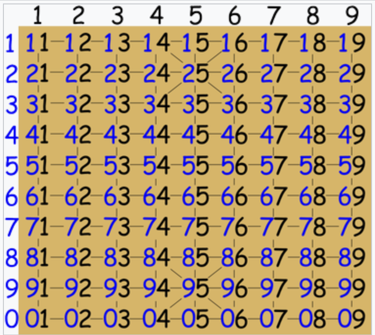

# java-janggi

장기 미션 저장소

## 기능 목록 정리
### 장기 게임

- 홍과 청이 번갈아가면서 게임을 진행한다.
    - 청이 먼저 시작한다.
- 상대방의 궁을 잡으면 승리한다. (게임이 끝난다)

### 장기판
- 10(가로) * 9(세로)
  - 장기판을 벗어나는 위치로 이동할 수 없다.

### 장기말

- 장기말은 색깔을 가지고 있다 (빨간색, 파란색)

졸, 병

- 앞이나 옆으로 한 칸 이동 가능
- 후퇴 불가

차

- 가로, 세로 무한으로 이동 가능
- 다른 기물이 이동 경로 사이에 있으면 이동 불가

상

- 선 한 칸 이동 + 대각성 두 칸 이동
- 다른 기물이 이동 경로 사이에 있으면 이동 불가

포

- 다른 기물 하나를 넘어야만 이동 가능
- 같은 포 끼리는 넘을 수 없음, 먹을 수 없음

마

- 선 한 칸 이동 + 대각선 한 칸 이동
- 다른 기물이 이동 경로 사이에 있으면 이동 불가

사 & 궁

- 이동 불가능
- 추후 변경 가능성 존재
---

## 구현
### 1.1 장기판 초기화

- 고정 위치로 초기화(마 ↔ 상 위치 바꾸기 없음)

```
  | 1  2 3  4 5  6 7  8 9
--|----------------------
1 | 차 상 마 사 ㅁ 사 상 마 차
2 | ㅁ ㅁ ㅁ ㅁ 한 ㅁ ㅁ ㅁ ㅁ
3 | ㅁ 포 ㅁ ㅁ ㅁ ㅁ ㅁ 포 ㅁ
4 | 병 ㅁ 병 ㅁ 병 ㅁ 병 ㅁ 병
5 | ㅁ ㅁ ㅁ ㅁ ㅁ ㅁ ㅁ ㅁ ㅁ
6 | ㅁ ㅁ ㅁ ㅁ ㅁ ㅁ ㅁ ㅁ ㅁ
7 | 졸 ㅁ 졸 ㅁ 졸 ㅁ 졸 ㅁ 졸
8 | ㅁ 포 ㅁ ㅁ ㅁ ㅁ ㅁ 포 ㅁ
9 | ㅁ ㅁ ㅁ ㅁ 초 ㅁ ㅁ ㅁ ㅁ
0 | 차 상 마 사 ㅁ 사 상 마 차
```

### 1.2 기물 이동

### 이동 입력

(움직이기 전 위치) (기물이름) (움직일 위치)
- ex) 03 마 84

- 위치 표기는 장기 좌표 표기법에 따른다.

