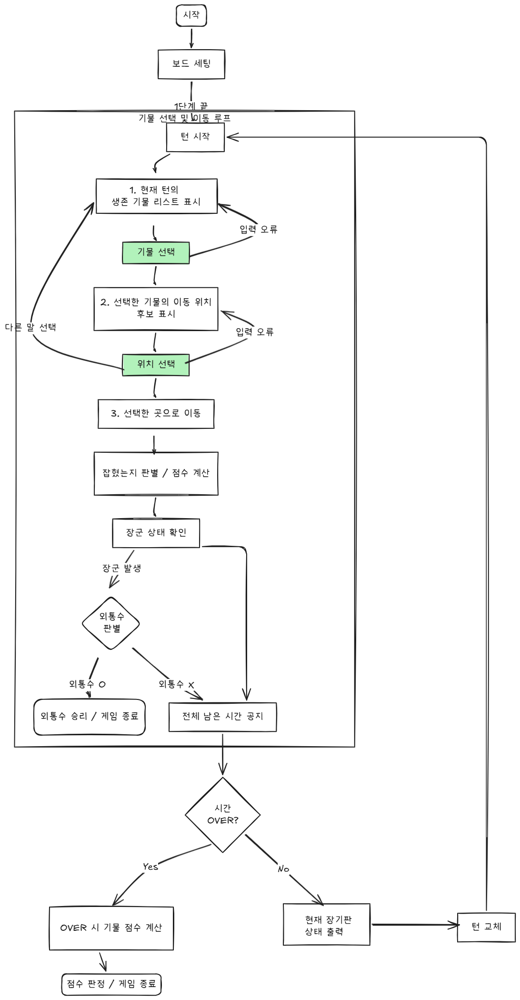
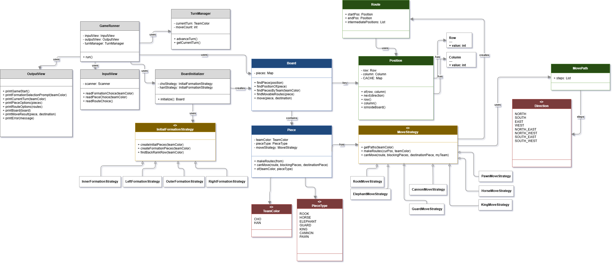

# java-janggi

장기 미션 저장소

## 구현 흐름

전체 게임 진행 흐름은 아래 플로우 차트를 기준으로 설계했다.

- 보드 세팅 후 턴이 시작된다.
- 현재 턴의 팀(`TeamColor`)은 자신의 기물 중 하나를 선택한다.
- 선택한 기물의 이동 가능 후보 위치를 확인한 뒤 목적지를 선택한다.
- 이동 이후 포획 여부, 점수, 장군/외통수 여부를 순서대로 판정한다.
- 시간 초과 여부를 확인하고, 종료 조건이 아니라면 현재 장기판 상태를 출력한 뒤 턴을 교체한다.

## 프로젝트 구조

<table>
  <tr>
    <td align="center">
      
       
      게임 흐름도
    </td>
    <td align="center">
      
       
      클래스 다이어그램
    </td>
  </tr>
</table>

### 주요 도메인 객체 설명

- `Board`
  - 현재 장기판 상태를 관리하는 중심 객체
  - `Map<Position, Piece>`를 사용해 특정 위치의 기물 조회, 특정 기물의 현재 위치 조회, 이동 가능 경로 검증, 실제 이동 반영을 담당
  - 장기판의 "현재 상태"와 그 상태를 기준으로 한 판정을 한곳에 모으기 위해 별도 객체로 두었다.
- `Position`
  - 장기판 위 한 칸의 위치를 표현
  - 유효한 행(Row)과 열(Column) 범위를 검증하는 값 객체로 사용
  - 보드의 거의 모든 규칙이 위치를 기준으로 동작하므로, 좌표를 원시값으로 흩뿌리지 않기 위해 분리했다.
- `Route`
  - 기물의 실제 이동 경로를 나타낸다.
  - 시작 위치, 도착 위치, 그리고 중간에 지나가는 칸들을 함께 가진다.
  - 장기에서는 "어디로 가는가", "중간에 무엇을 지나가는가" 두 가지 모두 중요하므로, 도착지만 표현하는 대신 경로 전체를 표현하는 정보를 묶어서 객체로 다룬다.
- `MovePath`
  - 기물이 따르는 이동 규칙 템플릿
  - ex. 마와 상처럼 여러 단계 방향 조합으로 움직이는 기물의 규칙을 표현하는 데 사용
  - 실제 장기판 좌표가 계산된 결과는 `Route`, 규칙 자체는 `MovePath`로 나누어 규칙 정의와 실행 결과를 분리
- `Piece`
  - 장기 기물 하나를 의미
  - 자신의 진영(`TeamColor`), 종류(`PieceType`), 이동 규칙(`MoveStrategy`)을 함께 가진다.
  - 기물마다 이동 방식이 다르기 때문에, 기물 종류와 전략을 연결하는 축으로 두었다.
- `PieceType`, `TeamColor`
  - 기물의 종류와 진영을 표현하는 분류 체계
  - 문자열 비교나 매직 넘버 대신 명확한 도메인 값으로 다루기 위해 분리
- `MoveStrategy`
  - 기물별 이동 규칙을 추상화한 전략 인터페이스
  - 차, 포, 마, 상, 왕, 사, 졸이 서로 다른 이동 규칙을 가지므로, 조건문을 한곳에 몰아넣지 않고 전략 객체로 분리
- `InitialFormationStrategy`
  - 게임 시작 시 초/한의 상차림 규칙을 표현하는 전략
  - 안상, 바깥상, 좌상, 우상처럼 초기 배치 변형이 존재하므로, 초기 세팅 규칙을 독립된 전략으로 분리
- `BoardInitializer`
  - 선택된 상차림 전략을 받아 초기 장기판 상태를 조립
  - 초기 기물 생성과 보드 생성 과정을 게임 진행 객체와 분리해, 시작 세팅 책임을 독립시켰다.
- `TurnManager`
  - 현재 턴의 진영 정보 저장 및 턴 전환만 관리하는 객체
- `GameRunner`
  - 입력, 출력, 초기 세팅, 턴 진행을 연결해 실제 게임 루프를 실행
  - 도메인 규칙 자체를 담기보다, 여러 도메인 객체를 조합해 사용자와 상호작용하는 흐름을 담당

### 사이클1 구현 내용

- [x] [기능구현] 게임에서 사용할 분류 체계 정의
  - 전역에서 공통으로 사용하는 값의 종류를 정리
  - ex) 팀 구분, 기물 종류, 게임 상태

- [x] [기능구현][예외처리] 장기판에서 사용할 좌표 체계를 정의
  - `Position`, `Direction`, `Route`가 어떤 의미를 가지는지 먼저 확정
  - 좌표 체계는 `Position.of(row, column)` 기준으로 정리
  - 행은 위에서 아래로 `0..9`, 열은 왼쪽에서 오른쪽으로 `0..8`
  - [예외처리] 유효하지 않은 좌표 생성 방지

- [x] [기능구현] 기물의 이동 규칙을 어떤 방식으로 표현할지 확정
  - 이동 규칙을 `MovePath`와 `Route` 생성 기반으로 표현
  - 단순 방향 목록뿐 아니라 중간 경로까지 포함하도록 정리
  - 궁성 영역 관련 규칙은 제외

- [x] [기능구현] 기물이 자신의 팀, 종류, 이동 규칙을 가지도록 공통 구조를 만든다
  - 모든 기물이 공통적으로 가져야 하는 속성과 동작을 정의
  - `Piece`가 `TeamColor`, `PieceType`, `MoveStrategy`를 조합하도록 구성

- [x] [기능구현] 각 기물을 게임에서 사용할 수 있는 형태로 구체화
  - 상, 마, 차, 졸, 사, 왕, 포가 생성 가능하도록 구현
  - 생성 시 팀 정보와 이동 규칙이 자연스럽게 연결되도록 구성

- [x] [상태관리][예외처리] 장기판의 현재 기물 배치 상태 저장, 조회 기능 구현
  - `Map<Position, Piece>` 기반으로 현재 배치 상태를 저장하고 조회
  - 특정 위치의 기물 조회, 특정 기물의 현재 위치 조회 가능
  - [예외처리] 보드에 없는 기물 이동 시 예외 처리

- [x] [초기화] 게임 시작 시 장기판을 초기 상태로 세팅
  - 초기 기물 생성
  - 초기 배치 좌표 정의
  - 초기 장기판 세팅

- [x] [기능구현] 규칙이 단순한 기물의 이동 가능 후보 경로를 계산
  - `졸`, `사`, `왕`의 후보 경로 계산 구현
  - 궁성 영역 관련 규칙은 제외

- [x] [기능구현] 규칙이 복잡한 기물의 이동 가능 후보 경로를 계산
  - `차`, `포`, `마`, `상`의 후보 경로 계산 구현
  - 차와 포는 직선 장거리 경로를 생성하도록 구현

- [x] [판정] 장기판이 빈 칸 여부와 경로 차단 여부를 판단하는 기능 구현
  - 목적지 점유 여부와 이동 경로 중간 칸 차단 여부를 함께 판단
  - 포의 다리 규칙도 중간 경로 정보를 활용해 판정

- [x] [판정][예외처리] 기물이 선택한 목적지로 실제 이동 가능한지 판정하는 기능 구현
  - 기물이 만든 이동 후보와 현재 장기판 상태를 함께 고려
  - 아군이 있는 칸인지, 적군이 있는 칸인지, 중간 경로가 막혔는지 등을 종합적으로 판정
  - 궁성 관련 판정은 제외
  - [예외처리] 이동 불가능한 경우 명확히 거부

- [x] [기능구현][상태관리][예외처리] 장기판에 기물을 배치하고 이동하는 기능 구현
  - 초기 배치와 실제 게임 중 이동 모두 처리할 수 있도록 구현
  - [x] [상태관리] 이동 후 보드 상태 갱신
  - [예외처리] 잘못된 이동 요청(범위 밖, 규칙 위반) 방지

- [x] [출력] 초기 장기판 상태를 출력할 수 있도록
  - 초기화 결과를 콘솔 보드 형태로 확인 가능

- [x] [출력] 특정 기물의 이동 후보 또는 이동 결과를 확인할 수 있도록
  - 선택 가능한 기물 목록 출력
  - 선택한 기물의 이동 후보 경로 출력
  - 이동 결과 출력

- [x] [상태관리] `TeamColor` 기반으로 현재 턴과 진영 상태를 관리
    - 별도의 Player 객체 없이 현재 턴 팀을 기준으로 게임 흐름을 제어
    - 현재 턴 확인 및 턴 교체 구현

- [x] [기능구현][상태관리] 포획이 발생했을 때 게임 상태 갱신
    - 이동한 목적지에 상대 기물이 있으면 기존 기물을 덮어써 포획 처리
    - [x] [상태관리] `Map<Position, Piece>` 보드 상태를 기준으로 점유 정보를 갱신

- [ ] [기능구현] 현재 보드 상태를 기준으로 팀별 점수를 계산
    - 시간 초과 시 `Map<Position, Piece>`에 남아 있는 기물을 기준으로 점수를 계산

- [x] [게임흐름] 턴 교체
    - 현재 턴 `TeamColor` 확인
    - 다음 턴 `TeamColor` 확인

- [x] [게임흐름][입력][출력] 최소 플레이가 가능한 게임 루프 생성
- [x] [출력] 현재 턴 팀의 기물 목록 출력
    - [x] [입력] 기물 선택 입력 처리
    - [x] [출력] 이동 후보 위치 출력
    - [x] [입력] 목적지 선택 입력 처리
    - [x] [기능구현] 이동 수행
    - [x] [출력] 현재 장기판 상태 출력
    - [x] [게임흐름] 턴 교체
    - 장군/외통수/시간 제한 배제하고 한 턴씩 진행 되도록

- [x] [입력][게임흐름][예외처리] 잘못된 입력이 들어왔을 때 같은 흐름 안에서 다시 선택할 수 있도록
    - [x] [입력] 존재하지 않는 기물 선택
    - [x] [입력] 이동 불가능한 목적지 선택
    - [x] [입력] 잘못된 형식의 입력 처리
    - [x] [예외처리] 입력 오류 발생 시 재입력 유도
    - [x] [게임흐름] 입력 오류가 났을 때 게임 전체가 깨지지 않고 현재 단계만 다시 진행되도록

---

### 사이클2 구현 내용

- [ ] [판정] 장군 멍군 구현
  - 현재 보드 상태 기준으로 장군 여부를 판단
  - 한 턴 종료 후 필수적으로 확인

- [ ] [판정] 장군 상태에서 벗어날 수 있는 수가 있는지 판정할 수 있도록
  - 외통수 여부를 판단
  - 외통수면 즉시 승리 및 게임 종료로 연결

- [ ] [게임흐름][판정] 게임 종료 조건이 발생했을 때 게임 종료하도록
  - 외통수로 종료
  - 점수 판정으로 종료
  - 종료 시 더 이상 턴이 진행되지 않도록 상태 변경

- [ ] [게임흐름] 시간 제한 규칙을 게임 흐름에 포함
  - 전체 시간 기준
  - 게임 시작 후 시간 측정 시작, 매 턴 종료 시 보드 상태 출력 후 시간 공지

- [ ] [판정][게임흐름] 시간 초과 시 점수로 승패를 판정
  - 시간 초과 감지
  - 각 플레이어 점수 계산
  - 승패 판정
  - 게임 종료 처리
---

## TDD 시나리오

### Position 시나리오
- 장기판 범위 내의 좌표로 생성할 시 정상 생성.
- 장기판 범위 밖의 좌표로 생성할 시에는 예외 처리
- 행(`row`)과 열(`column`) 범위를 각각 검증

### JanggiBoard 시나리오
- 보드 상태는 `Map<Position, Piece>` 형태로 관리한다.
- Initializer로부터 초기화되었을 때 모든 말들의 위치정보를 가지고 있다.
- 기물과 현재 판 상태를 기반으로 이동 가능한지 여부를 반환한다.
  - 범위를 초과하면 이동할 수 없다
  - 이동하고자 하는 곳에 같은 팀 기물이 있으면 이동할 수 없다
  - 이동 경로에 다른 기물이 있으면 규칙에 맞지 않는 경우 이동할 수 없다
  
### MoveStrategy 시나리오
- 각 말들의 MoveStrategy가 우리가 의도한 규칙에 맞게 `MovePath`를 생성한다.
  - 졸은 전진과 좌우 한 칸
  - 차는 상하좌우 장거리
  - 포는 상하좌우 장거리 + 다리 규칙
- 같은 팀 말이 있는 도착지로는 이동할 수 없다.
  - 상
  - 마
  - 차
  - 졸
  - 포: intermediateRoutes에서 가져온 말들의 개수가 1이고, 포가 아닌 경우만 이동 가능
  - 사
  - 왕
- 장기 보드와 협력하여 이동 가능한 위치 정보를 받아 루트 정보들을 생성한다.

### Initializer 시나리오
- 게임 초기의 말들의 위치 정보를 `Map<Position, Piece>` 형태로 가지고 있다.
- `Position(row, column)` 기준으로 초/한의 초기 배치를 올바르게 구성한다.

### TurnManager 시나리오
- 현재 턴의 `TeamColor`가 무엇인지 반환한다.
- 턴이 바뀌면 `CHO`와 `HAN`이 스왑된다.
- 별도의 Player 객체 없이 팀 색상만으로 턴을 관리한다.

### Runner 시나리오
- 기물 선택, 이동 위치 선택 입/출력을 진행한다.
- Initializer에게 `Map<Position, Piece>` 기반 장기판을 세팅하는 함수를 호출한다.
- 현재 턴 팀이 정상적인 기물을 선택하고, 정상적인 이동 목적지를 입력하면 보드 상태를 갱신한다.
- TurnManager에게 턴을 교체하는 함수를 호출한다.
- 현재 턴 팀이 정상적인 기물 번호를 선택하지 않으면, 예외를 발생하고 기물 선택으로 돌아온다.
- 현재 턴 팀이 정상적인 이동 목적지를 입력하지 않으면, 예외를 발생하고 현재 턴 흐름 안에서 다시 선택한다.

## 미션 중 기록

- 상태 위치를 결정할 때 고민한 순간 1회
- 불변/캡슐화를 적용한 코드 1곳
- 규칙 적용으로 변경한 설계 1곳
- 조건문을 다형성으로 대체한 코드 1곳
- 인터페이스/추상경 클래스를 도입한 이유
- 새 기물 추가 시 변경 범위 테스트 (가상으로)

### 사이클 2 진행
사이클 2 진행 과정에 대한 기록은 [이곳](docs/cycle2.md)에서 기록합니다.
