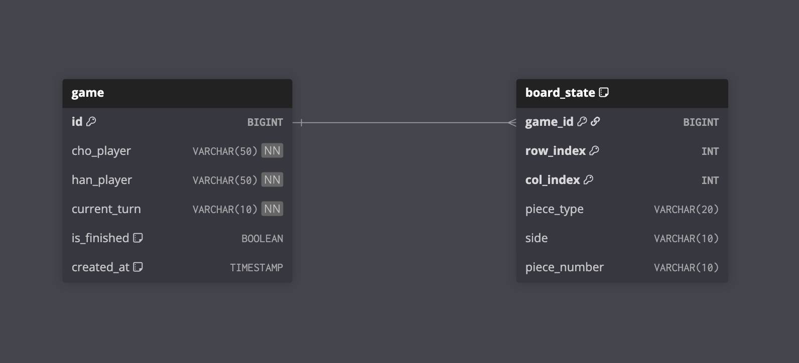

# java-janggi

## 📋 목차
- [개요](#-개요)
- [구현 기능 목록](#-구현-기능-목록)
- [입출력 요구 사항](#입출력-요구-사항)
- [커밋 컨벤션](#커밋-컨벤션)

---

## 1️⃣ 개요

### 기능 흐름

```
1-1. 초 진영 플레이어의 이름을 입력받는다.
↓
1-2. 한 진영 플레이어의 이름을 입력받는다.
↓
2. 장기판과 기물을 초기화하고 게임을 시작한다.
↓
┌─→ 3. 현재 턴인 플레이어에게 이동할 기물을 입력받는다.
│            ↓
│   4. 해당 기물이 이동 가능한 경로를 출력한다.
│            ↓
│   5-1. 해당 기물이 이동할 좌표(행)를 입력받는다.
│            ↓
│   5-2. 해당 기물이 이동할 좌표(열)를 입력받는다.
│            ↓
│   6. 해당 이동이 규칙(공통/개별)에 맞는지 검증한다.
│   ⬆️ ↙ [불가능]                       ↘ [가능]
│  (재입력)                     7. 기물을 이동하고 장기판을 갱신한다.
│  
------------------------1차 구현 및 PR 포인트---------------------------
│                                         
│                                         ↓
│                               6. 상대의 '궁'이 잡혔는지 확인한다.
│                                 ↙ [아니오]          ↘ [예]
└─────────────────────────────────┘             7. 게임을 종료한다.
                                                      ↓
                                                8. 승패 결과를 출력한다.
```

## 2️⃣ 구현 기능 목록 (사이클 1: 보드 초기화 + 기물 이동)

## 1. 게임 준비 및 플레이어 설정

- [x] **[UI]** 선수(초)와 후수(한) 플레이어의 이름을 입력받는다. `class InputView`
    - [x] [출력] 초 진영의 플레이어 이름 입력 안내문 출력 - `class OutputView`
    - [x] [입력] 초 진영의 플레이어 이름 입력 - `public String readPlayerName`
    - [x] [출력] 한 진영의 플레이어 이름 입력 안내문 출력 - `class OutputView`
    - [x] [입력] 한 진영의 플레이어 이름 입력 - `public String readPlayerName`
    - [x] [예외 처리] 입력이 비어있는 경우, `IllegalArgumentException`을 발생시키고 재입력을 받는다.

- [x] **[Domain]** 플레이어가 속할 진영을 관리하는 클래스 `class Side`
    - [x] [규칙] 진영은 초와 한으로 나뉘고, 각각의 이름을 가진다 `private final String displayName`

- [x] **[Domain]** 플레이어를 관리하는 클래스 `class Player`
    - [x] [규칙] 플레이어는 진영을 가지고, 각각의 이름을 가진다.
      `private final Side side` `private final String nickname`

- [x] **[Domain]** 플레이어들을 관리할 일급 컬렉션 `class Players`
    - [x] [규칙] 플레이어들을 관리할 컬렉션을 가진다. `private Set<Player> players`
    - [x] [규칙] 각 진영의 플레이어 이름으로 플레이어 일급 컬렉션 생성 `public from(String choPlayer, String hanPlayer)`
    - [x] [규칙] 각 진영의 플레이어 이름으로 플레이어 객체 생성 `public Player(String name, Side side)`
    - [x] [예외 처리] 플레이어 닉네임이 중복되는 경우, `IllegalArgumentException` 을 발생시킨다. `private void validateDuplicatedName(String choPlayerName, String hanPlayerName)`


## 2. 보드 초기화 및 출력

- [x] **[Domain]** 기물의 위치를 관리하는 클래스 `record Position`
    - [x] [규칙] 기물의 행 번호를 표시 `private final int row`
    - [x] [규칙] 기물의 열 번호를 표시 `private final int column`
    - [x] [규칙] 보드의 행 최댓값을 표시 `private final int BOARD_MAX_ROW`
    - [x] [규칙] 보드의 행 최솟값을 표시 `private final int BOARD_MIN_ROW`
    - [x] [규칙] 보드의 열 최댓값을 표시 `private final int BOARD_MAX_COLUMN`
    - [x] [규칙] 보드의 열 최솟값을 표시 `private final int BOARD_MIN_COLUMN`
    - [x] [규칙] 이동할 거리를 받아 이동한 결과를 새로운 객체로 리턴한다 `public Position of(int row, int column)`
    - [x] [예외 처리] 클래스 생성 시, 보드의 행 / 열 범위를 벗어나는 위치면 `IllegalArgumentException` 을 발생시킨다.
      `private void validateBounds(int row, int column)`

- [x] **[Domain]** 기물의 이동 경로를 관리하는 클래스 `class Path`
    - [x] [규칙] 기물의 이동 경로를 위치의 목록으로 표시 `private final List<Position> positions`
    - [x] [규칙] 기물의 위치를 하나씩 받아 이동 경로를 표시 `public void makePath(Position nextPosition)`

- [x] **[Domain]** 기물의 모든 이동 경로를 관리하는 일급 컬렉션 `class Paths`
    - [x] [규칙] 기물이 이동할 수 있는 모든 경로를 목록으로 표시 `private final List<Path> paths`
    - [x] [규칙] 기물의 이동 경로를 하나씩 받아 모든 이동 경로를 표시 `public void addPath(Path path)`

- [x] **[Domain]** 기물의 최소 이동 단위를 관리하는 클래스 `enum Direction`
    - [x] [규칙] 기물의 모든 최소 이동 단위 경우의 수를 정의
      - E(0, 1)
      - W(0, -1)
      - S(1, 0)
      - N(-1, 0)
      - NE(-1, 1)
      - NW(-1, -1)
      - SE(1, 1)
      - SW(1, -1)
    - [x] [규칙] 이동 단위는 초기 위치 `class Positoin` 을 받아, 이동 위치 `class Position` 를 반환한다.
      `public Static Position move(Position currentPosition)`

- [x] **[Domain]** 기물의 이동 규칙(전략)을 관리하는 클래스 `interface MoveStrategy`
    - [x] [규칙] 기물이 이동 가능한 모든 `경로`를 계산해서, 경로의 집합으로 반환  
      `Paths findMovablePaths(Position current, EnumSet<Direction> directions)`
    - [x] [규칙] 기물이 이동 가능한 모든 `위치`를, 해당 경로에 있는 기물 정보를 반영하고 계산해서 반환  
      `List<Position> determineDestinations(Paths routes, Map<Position, PieceVO> boardState, PieceVO movingPieceVO)`

- [ ] **[Domain]** 기물의 이동 규칙(전략)을 관리하는 구현체 클래스 `class Strategy implements MoveStrategy`
    - [x] * `1.1단계 - 보드 초기화` 를 선행하기 위해 비워 둠 
    - [ ] [규칙] 각 기물별 이동 규칙을 구현하고, 동일성이 존대한다면 묶는다

- [x] **[`Domain/VO`]** 기물의 이동 가능성을 판정하기 위한 최소 정보를 전달할 클래스 `record PieceVO`
    - [x] [규칙] 기물의 진영을 전달 `Side side`
    - [x] [규칙] 같은 진영인지 판별 `public boolean isAlly(PieceVO)`
    - [x] [규칙] 기물의 종류를 전달 `PieceType pieceType`
    - [x] [규칙] 기물의 종류를 판별 -> 현재 필요한 건 포 여부 뿐 `public boolean isCannon()`
    - [x] [규칙] 기물의 번호(식별자)를 전달 `PieceType pieceType` - 현재 불필요하지만 추가해서 전달

- [x] **[Domain]** 기물의 종류, 이동 규칙을 관리하는 클래스 `enum PieceType`
    - [x] [규칙] 기물의 종류 `PieceType`
      - General
      - Guard
      - Horse
      - Elephant
      - Chariot
      - Cannon
      - Soldier
    - [x] [규칙] 기물의 이동 규칙 `class Strategy implements MoveStrategy`
      - [x] [규칙] * `1.1단계 - 보드 초기화` 를 선행하기 위해 비워 둠

- [x] **[Domain]** 기물의 정보를 관리하는 클래스 `class Piece`
    - [x] [규칙] 기물의 고유한 식별자 `private final String pieceNumber`
    - [x] [규칙] 기물의 고유한 종류 `private final PieceType pieceType`
    - [x] [규칙] 기물의 소속 진영 `private final Side side`
    - [x] [규칙] 기물이 이동 가능한 모든 `경로`를 계산해서, 경로의 집합으로 반환
      `public Paths calculatePaths(Position current)`
    - [x] [규칙] 기물이 이동 가능한 모든 `위치`를, 해당 경로에 있는 기물 정보를 반영하고 계산해서 반환
      `public List<Position> determineDestinations(Paths routes, Map<Position, PieceVO> boardState)`
    - [x] [규칙] 기물의 상태를 포장된 객체로 반환 `public PieceVO toVO()`

- [x] **[Domain]** 게임판과 그에 속한 기물, 각 기물의 위치를 관리할 일급 컬렉션 `class Board`
    - [x] [규칙] ※ 요구사항 분석과 미션 진행 설계에 따라 상/마 자유 배치 생략, 기본 위치로 일괄 고정.
    - [x] [규칙] 각 진영에 속한 `졸(병) 포 차 마 상 사 궁` 을 배치한다.
        
      - [x] [규칙] `졸(병)` 은 5개, 각 진영 첫 번째 행 (초-6, 한-3) 양 끝 열 (0, 8) 에서부터, 한 칸의 간격을 두고 배치한다.
        
      - [x] [규칙] `포` 는 2개, 각 진영 두 번째 행 (초-7, 한-2) 양 끝 열 (0, 8) 에서 한 칸의 간격을 두고 배치한다.
        
      - [x] [규칙] `차` 는 2개, 각 진영 마지막 행 (초-9, 한-0) 양 끝 열 (0, 8) 에 배치한다.
        
      - [x] [규칙] `상` 은 2개, 각 진영 마지막 행 (초-9, 한-0) 양 끝에서 한 칸 떨어진 열 (1, 7) 에 배치한다.
        
      - [x] [규칙] `마` 는 2개, 각 진영 마지막 행 (초-9, 한-0) 양 끝에서 두 칸 떨어진 열 (2, 6) 에 배치한다.
        
      - [x] [규칙] `사` 는 2개, 각 진영 마지막 행 (초-9, 한-0) 양 끝에서 세 칸 떨어진 열 (3, 5) 에 배치한다.
        
      - [x] [규칙] `궁` 은 1개, 각 진영 마지막에서 한 칸 윗 행 (초-8, 한-1) 중간 열 (4) 에 배치한다.
      - 

- [x] **[DTO/UI]** 현재 장기판의 상태를 출력한다. `class OutputView`
    - [x] [`!임시`] 장기판 `class Board`의 기물 배치 상태 `Map<Position, Piece> piecePosition`를 바탕으로 `class BoardDTO` 생성 `public BoardDTO from(Board board)`
    - [x] [`!임시`] `BoardDTO`를 전달받아 장기판의 기물 배치 상태를 콘솔에 출력한다.  
      `public void printBoardStatus(BoardDTO boardDto)`


## 3. 기물 이동 로직

- [x] **[UI]** 현재 턴의 플레이어에게 이동할 기물과 도착 위치를 차례로 입력받는다.
    - [x] [규칙] 게임은 항상 초(초)가 먼저 시작한다.
    - [x] [예외 처리] 보드 밖의 좌표, 빈 공간, 또는 상대방의 기물을 선택한 경우 예외 발생 후 재입력.

- [x] **[Domain]** 공통 이동 규칙을 검증한다.
    - [x] [규칙] 도착 위치에 같은 팀(아군) 기물이 있으면 이동할 수 없다.
    - [ ] [규칙] 이동 이후 자신의 '궁'이 상대에게 잡힐 수 있는 위험한 상태(장군)가 된다면, 그 이동은 허용되지 않는다.

- [x] **[Domain]** 개별 기물의 이동 규칙을 검증한다.
    - [x] [규칙] **궁/사**: 궁성 내에서 모든 방향으로 1칸 이동 가능하다.
    - [x] [규칙] **차**: 상하좌우로 거리 제한 없이 이동할 수 있다. 단, 이동 경로 중간에 다른 기물이 있으면 뛰어넘을 수 없다.
        - [x] [규칙]: 진영 상관없이 궁성 내로 진입하는 경우, 거리 제한 없이 대각선 이동이 가능하다.
    - [x] [규칙] **포**: 이동 경로 사이에 반드시 다른 기물이 하나 이상 있어야 하며, 넘는 기물이 '포'이면 안 된다. 또한 도착 위치의 기물이 '포'인 경우에는 잡을 수 없다.
        - [x] [규칙]: 진영 상관없이 궁성 내로 진입하는 경우, 대각선을 포함하여 포를 제외한 기물을 뛰어넘을 수 있다.
    - [x] [규칙] **마**: 직진 한 칸 후 대각선 한 칸 이동한다. 직진하는 첫 칸에 기물이 있으면 이동할 수 없다 (멱).
    - [x] [규칙] **상**: 직진 한 칸 후 대각선으로 두 칸 이동한다. 이동 경로(직선 1칸, 대각선 1칸)가 막혀 있으면 이동할 수 없다 (멱).
    - [x] [규칙] **졸/병**: 한 칸씩 전진 및 좌우 이동만 가능하다. (후퇴 불가)
        -[x] [규칙]: 상대방의 궁성 안으로 들어갈 경우, 대각선을 포함하여 전진 이동만 가능하다.

- [x] **[UI]** 선택한 기물이 이동할 수 있는 유효한 위치 목록을 출력한다.

- [x] **[UI]** 도착 위치를 입력받는다. `class InputView`

- [x] **[Domain]** 검증을 통과하면 기물을 이동시키고 장기판을 갱신한다.


## 4. 승패 판정 및 게임 종료 (1차 PR 이후 구현)

- [x] **[Domain]** 상대의 '궁'이 잡혔는지 판단하여 게임 종료 여부를 결정한다.
    - [x] [규칙] 기물 이동 후, 한쪽의 '궁'이 보드판에서 사라졌다면 즉시 게임이 끝난다.

- [x] **[Domain]** 현재 남아 있는 기물의 총점을 구한다.
    - [x] [규칙] 궁을 잡으면 게임이 끝나기 때문에, 궁의 점수는 0으로 한다.
    - [x] [규칙] 차: 13점
    - [x] [규칙] 포: 7점
    - [x] [규칙] 마: 5점
    - [x] [규칙] 상: 3점
    - [x] [규칙] 사: 3점
    - [x] [규칙] 졸/병: 2점

- [x] **[UI]** 최종 승패 결과를 출력한다.
    - [x] [출력] 상대방의 장을 잡은 진영(플레이어)을 승자로 출력한다.


## 5. 데이터베이스 연동 및 영속성 관리

- [x] **[Infrastructure]** JDBC를 이용해 MySQL을 연동한다. `class DBConnection`
    - [x] [규칙] `DB_URL`, `DB_USER`, `DB_PASSWORD`를 환경 변수로 설정해 DB를 연결한다.

- [x] **[Persistence]** 게임 상태 및 보드 정보를 저장한다. `class JdbcJanggiRepository`
    - [x] [규칙] 새로운 게임 시작 시, 플레이어 정보 및 초기화된 턴을 저장한다. `public Long save(Players players)`
    - [x] [규칙] 기물 이동 시마다 현재 장기판의 상태를 업데이트한다. `public void updateGameStatus`
        - [x] [규칙] 턴 변경과 보드 상태 갱신이 원자적으로 이루어지도록 트랜잭션을 보장한다.
    - [x] [규칙] 종료되지 않고, 진행 중인 가장 최근의 게임 ID를 조회한다. `public Optional<Long> findInProgressGameId`
    - [x] [규칙] 저장된 게임 ID를 바탕으로 이전 게임의 플레이어, 턴, 보드 상태를 복원한다.
    - [x] [규칙] 승패 결정 시, 해당 게임의 종료 상태(`is_finished`)를 반영한다. `public void finishGame`

- [x] **[Database]** 게임 영속화를 위해 데이터 스키마를 설계한다.
    - [x] `game`: 게임 기본 정보 및 현재 턴, 종료 여부 관리
    - [x] `board_state`: 각 게임 ID별 기물의 종류, 진영, 위치, 고유 번호 관리



## 6. 실행 방법

**✅ 프로그램을 실행하기 위해 로컬 환경에 `MySQL`이 설치되어 있어야 하며, 아래와 같은 데이터베이스 설정이 필요합니다.**

1. 데이터베이스 생성: janggi_db (또는 원하는 이름)
2. 테이블 생성: `src/main/resources/schema.sql` 파일을 실행하여 필요한 테이블을 생성

### 프로그램 실행을 위해 필요한 환경 변수

- `DB_URL`: JDBC 연결 주소 (예: jdbc:mysql://localhost:3306/janggi_db)
- `DB_USER`: MySQL 사용자 이름
- `DB_PASSWORD`: MySQL 비밀번호

➡️ IntelliJ를 사용하는 경우, `Run/Debug Configurations`의 `Environment variables` 항목에서 편리하게 설정할 수 있습니다.

## 3️⃣ 입출력 요구 사항

### 실행 결과 예시

```
선수(초) 플레이어의 이름을 입력하세요.
pobi

후수(한) 플레이어의 이름을 입력하세요.
jason

장기판의 현황은 다음과 같습니다. 

　　║　　0　　　　1　　　　2　　　　3　　　　4　　　　5　　　　6　　　　7　　　　8
　　║===============================================================
０　║［차０］━［마０］━［상０］━［사０］━［　　］━［사１］━［상１］━［마１］━［차１］
　　║　　┃　　　　┃　　　　┃　　　　┃　　　　┃　　　　┃　　　　┃　　　　┃　　　　┃
１　║［　　］━［　　］━［　　］━［　　］━［한０］━［　　］━［　　］━［　　］━［　　］
　　║　　┃　　　　┃　　　　┃　　　　┃　　　　┃　　　　┃　　　　┃　　　　┃　　　　┃
２　║［　　］━［포０］━［　　］━［　　］━［　　］━［　　］━［　　］━［포１］━［　　］
　　║　　┃　　　　┃　　　　┃　　　　┃　　　　┃　　　　┃　　　　┃　　　　┃　　　　┃
３　║［병０］━［　　］━［병１］━［　　］━［병２］━［　　］━［병３］━［　　］━［병４］
　　║　　┃　　　　┃　　　　┃　　　　┃　　　　┃　　　　┃　　　　┃　　　　┃　　　　┃
４　║［　　］━［　　］━［　　］━［　　］━［　　］━［　　］━［　　］━［　　］━［　　］
　　║　　┃　　　　┃　　　　┃　　　　┃　　　　┃　　　　┃　　　　┃　　　　┃　　　　┃
５　║［　　］━［　　］━［　　］━［　　］━［　　］━［　　］━［　　］━［　　］━［　　］
　　║　　┃　　　　┃　　　　┃　　　　┃　　　　┃　　　　┃　　　　┃　　　　┃　　　　┃
６　║［졸０］━［　　］━［졸１］━［　　］━［졸２］━［　　］━［졸３］━［　　］━［졸４］
　　║　　┃　　　　┃　　　　┃　　　　┃　　　　┃　　　　┃　　　　┃　　　　┃　　　　┃
７　║［　　］━［포０］━［　　］━［　　］━［　　］━［　　］━［　　］━［포１］━［　　］
　　║　　┃　　　　┃　　　　┃　　　　┃　　　　┃　　　　┃　　　　┃　　　　┃　　　　┃
８　║［　　］━［　　］━［　　］━［　　］━［초０］━［　　］━［　　］━［　　］━［　　］
　　║　　┃　　　　┃　　　　┃　　　　┃　　　　┃　　　　┃　　　　┃　　　　┃　　　　┃
９　║［차０］━［마０］━［상０］━［사０］━［　　］━［사１］━［상１］━［마１］━［차１］

(초) 플레이어 pobi 님의 턴입니다. 

이동할 기물을 입력해주세요.
졸0

졸0 의 현재 좌표는 6 0 입니다.

이동할 좌표의 행을 입력해주세요.
6

이동할 좌표의 열을 입력해주세요.
1

장기판의 현황은 다음과 같습니다. 

　　║　　0　　　　1　　　　2　　　　3　　　　4　　　　5　　　　6　　　　7　　　　8
　　║===============================================================
０　║［차０］━［마０］━［상０］━［사０］━［　　］━［사１］━［상１］━［마１］━［차１］
　　║　　┃　　　　┃　　　　┃　　　　┃　　　　┃　　　　┃　　　　┃　　　　┃　　　　┃
１　║［　　］━［　　］━［　　］━［　　］━［한０］━［　　］━［　　］━［　　］━［　　］
　　║　　┃　　　　┃　　　　┃　　　　┃　　　　┃　　　　┃　　　　┃　　　　┃　　　　┃
２　║［　　］━［포０］━［　　］━［　　］━［　　］━［　　］━［　　］━［포１］━［　　］
　　║　　┃　　　　┃　　　　┃　　　　┃　　　　┃　　　　┃　　　　┃　　　　┃　　　　┃
３　║［병０］━［　　］━［병１］━［　　］━［병２］━［　　］━［병３］━［　　］━［병４］
　　║　　┃　　　　┃　　　　┃　　　　┃　　　　┃　　　　┃　　　　┃　　　　┃　　　　┃
４　║［　　］━［　　］━［　　］━［　　］━［　　］━［　　］━［　　］━［　　］━［　　］
　　║　　┃　　　　┃　　　　┃　　　　┃　　　　┃　　　　┃　　　　┃　　　　┃　　　　┃
５　║［　　］━［　　］━［　　］━［　　］━［　　］━［　　］━［　　］━［　　］━［　　］
　　║　　┃　　　　┃　　　　┃　　　　┃　　　　┃　　　　┃　　　　┃　　　　┃　　　　┃
６　║［　　］━［졸０］━［졸１］━［　　］━［졸２］━［　　］━［졸３］━［　　］━［졸４］
　　║　　┃　　　　┃　　　　┃　　　　┃　　　　┃　　　　┃　　　　┃　　　　┃　　　　┃
７　║［　　］━［포０］━［　　］━［　　］━［　　］━［　　］━［　　］━［포１］━［　　］
　　║　　┃　　　　┃　　　　┃　　　　┃　　　　┃　　　　┃　　　　┃　　　　┃　　　　┃
８　║［　　］━［　　］━［　　］━［　　］━［초０］━［　　］━［　　］━［　　］━［　　］
　　║　　┃　　　　┃　　　　┃　　　　┃　　　　┃　　　　┃　　　　┃　　　　┃　　　　┃
９　║［차０］━［마０］━［상０］━［사０］━［　　］━［사１］━［상１］━［마１］━［차１］

(한) 플레이어 jason 님의 턴입니다. 

```

---

## 4️⃣ 커밋 컨벤션

Following convention : https://gist.github.com/stephenparish/9941e89d80e2bc58a153

```markdown
# basic structure
<type>(<scope>): <subject>
<BLANK LINE>
<body>
<BLANK LINE>
<footer>

# <type>
feat (feature)
fix (bug fix)
docs (documentation)
style (formatting, missing semi colons, …)
refactor
test (when adding missing tests)
chore (maintain)

# <scope>
console - I/O
domain - 핵심 로직
validation - 유효성검사
test - 테스트코드 추가
```