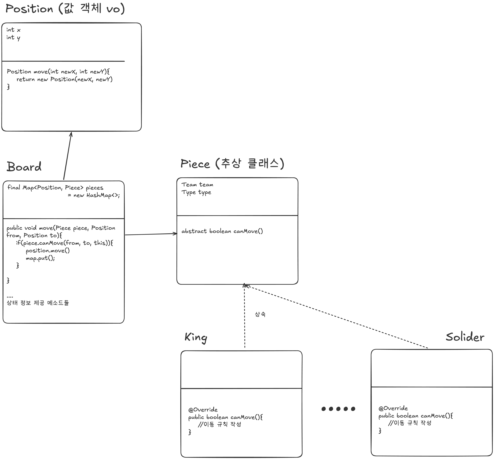
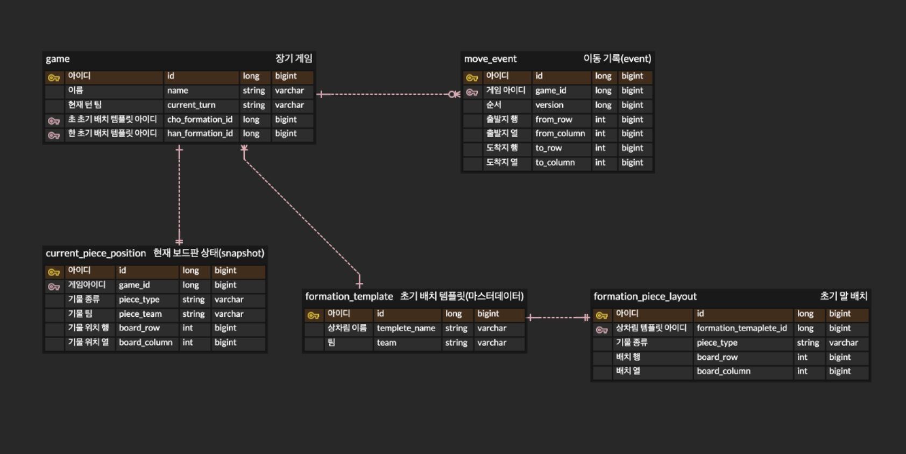

# 기능 명세 및 설계

# 0. 설계도(어플리케이션 - DB)

- db는 이벤트 소싱 방식을 도입

# 1. 기능 명세서 - 사용 흐름대로 + 초기에 설정해야 할 것

### 1-1. 초기 플레이어 입력 받기

- [ ]  각 플레이어 이름과 진영을 입력받는다.
    - “초나라 진영의 플레이어 이름을 입력하세요: pobi“
    - “한나라 진영의 플레이할 플레이어 이름을 입력하세요: woni“
- [ ]  각 플레이어의 차림을 입력받는다.
    - “초나라의 차림을 입력해주세요: 상마상마”
    - “한나라의 차림을 입력해주세요: 마상마상”

### 1-2. 장기판 초기화

- [ ]  초나라와 한나라의 초기 기물 위치를 배정한다. 이때, 입력받은 차림을 반영한다.

### 1-3. 게임 진행

- [ ]  초나라 플레이어는 이동하고 싶은 기물과 이동 위치를 입력한다.
    - 예: 초나라 pobi는 이동하고 싶은 기물과 이동위치를 입력해주세요: “차, (2,3)”
    - [ ]  이때 플레이어는 한수쉼을 입력할 수 있다.
        - 예: 초나라 pobi는 이동하고 싶은 기물과 이동위치를 입력해주세요: 한수쉼
- [ ]  해당 기물이 원하는 위치로 이동할 수 있는지 판단한다.
    - [ ]  불가능한 경우, 재입력을 실행한다.
        - “이동이 불가능합니다. 다시 입력해주세요.”
- [ ]  이동 가능한 경우, 기물을 이동시킨다.
    - [ ]  상대팀 기물을 잡는 경우, 해당 정보를 출력한다.
        - “상대 포를 잡았습니다.”
- [ ]  이동 완료된 장기판 상태를 출력한다.
    - 보드판 UI로 출력을 제공한다.
- [ ]  한나라의 플레이어도 위의 과정을 반복한다.

### 1-4. 게임 종료

- [ ]  궁이 잡히는 경우, 게임이 종료된다.
    - “게임 결과: 한나라가 승리하였습니다.”

# 2. 규칙 정의

## 2-1. 기물의 규칙

### 2-1-1. 기물의 종류와 개수 (초/한 진영)

| 기물명 | 개수(각 진영별) | 이동 규칙 |
| --- | --- | --- |
| 궁 | 1개 | 궁성 내에서만 모든 방향으로 한 칸씩 다닐 수 있다. |
| 사 | 2개 | 궁성 내에서만 모든 방향으로 한 칸씩 다닐 수 있다. |
| 차 | 2개 | 장애물만 없으면 직선으로 전후좌우, 궁성의 사선을 타고 칸수 제한 없이 다닐 수 있다. |
| 포 | 2개 | 차와 마찬가지로 직선으로 전후좌우, 궁성의 사선을 타고 칸수 제한없이 다닐 수 있다. 다만 아래 조건이 따른다. 
• 반드시 다른 기물 하나를 넘어야 한다. 하지만 해당 기물이 포일 수는 없다.
• 같은 포를 잡을 수 없다. |
| 마 | 2개 | 일보 전진 이후, 대각선으로 좌,우로 한칸 이동할 수 있다. 다만, 일보 전진하는 경우 장애물이 있으면 이동할 수 없다. |
| 상  | 2개 | 일보 전진 이후, 대각선으로 좌,우로 두칸 이동할 수 있다. 다만, 전진하는 경로에 장애물이 있으면 이동할 수 없다. |
| 졸(병) | 5개 | 한 칸씩 앞이나 옆으로만 이동이 가능하다. (뒤로 이동이 불가능하다.)
• 추가로 상대방의 궁성에 있는 경우, 궁성의 간선을 타고 한 칸 이동 가능하다. |

## 2-2. 어플리케이션 검증 규칙

### 2-2-1. 플레이어 이름 입력 규칙

- 플레이어 이름은 5자 이하여야 한다.
- 플레이어 이름은 null이거나 빈값일 수 없다.

### 2-2-2. 플레이어 차림 입력 규칙

- 차림으로는 아래 4가지 입력만 들어올 수 있다.
    - “상마상마”, “마상마상”, “상마마상”, “마상상마”

### 2-2-3. 이동 기물 및 위치 입력 규칙

- 이동 기물은 “궁,차,포,마,상,사,졸(병)”만 입력으로 들어올 수 있다.
- 이동 위치는 “1,1”와 같이 좌표형태의 숫자값만 입력으로 들어올 수 있다. 좌표는 쉼표로 구분한다.
- 추가적으로 “한수쉼”이 들어올 수 있다.

## 2-3. 기물 점수 규칙
- 현재 장기판에 남아있는 기물들의 각 점수를 합산하여, 현재 점수를 계산한다.
- 각 기물의 점수는 중요도 순으로 높은 배점을 가지며, 각 점수는 다음과 같다.

| 기물  | 점수             |
|-----|----------------|
| 궁   | 0점(점수 계산에서 배제) |
| 차   | 13점            |
| 포   | 7점             |
| 마   | 5점             |
| 상   | 3점             |
| 사   | 3점             |
| 졸(병) | 2점             |

# 3. 용어 사전

### 3-1. 기본 용어

| 용어(한글) | 영문 | 설명 |
| --- | --- | --- |
| 기물 | Pieces | 장기 알 (궁 1개, 차 2개, 포2개, 마 2개, 상 2개, 사 2개, 졸(병) 5개로 16개씩, 총 32개) |
| 상마상마 배치 | **Elephant-Horse Formation** | 상마상마의 차림을 의미한다. |
| 한나라 | Han | 빨간색 장기 알 |
| 초나라 | Chu | 녹색(파란색) 장기 알 |
| 한수쉼 | Hansooshim | 플레이어가 자신의 차례를 넘기는 행위 |

### 3-2. 기물 용어

| 용어(한글) | 영문 |
| --- | --- |
| 궁 | King |
| 차 | Rook |
| 포 | Cannon |
| 마 | Horse |
| 상 | Elephant |
| 사 | guard |
| 졸(병) | pawn |
