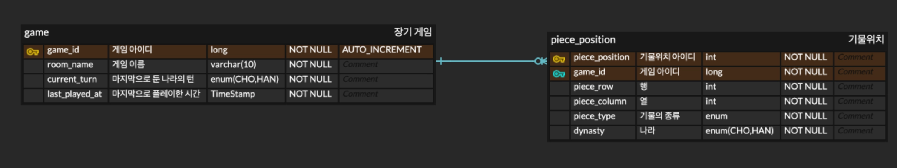

# 🀄️장기

## 📚 용어 정리 및 모델링

### 장기 게임(Game)
| 용어           | 설명                    |
|--------------|-----------------------|
| Game         | 장기 게임의 흐름을 처리.        |
| CurrentTurn  | 현재 기물을 움직일 수 있는 나라 정보 |
| RoomName     | 장기 게임 방의 이름           |
| lastPlayedAt | 마지막으로 해당 게임을 플레이한 시간  |

### 장기판 (Board)

| 용어    | 설명                                         |
|-------|--------------------------------------------|
| Board | 기물이 놓이는 곳. Map<Position, Piece>의 형태로 관리된다. |

### 기물 (Piece)

| 용어          | 설명                                                                                      |
|-------------|-----------------------------------------------------------------------------------------|
| Piece       | 고유한 이동규칙을 갖는 게임 객체.                                                                     |
| Piece Type  | 기물의 유형.  CANNON(포), CHARIOT(차), ELEPHANT(상), GENERAL(장), GUARD(사), HORSE(마), SOLDIER(졸) |
| Piece Score | 기물의 점수. Chariot:13, Cannon:7, Horse:5, Elephant:3, Guard:3, Soldier:2                   |

### 이동 규칙 (Move Strategy)

| 용어            | 설명         |
|---------------|------------|
| Move Strategy | 기물의 이동 규칙. |

### 위치 (Position)

| 용어       | 설명                   |
|----------|----------------------|
| Position | 장기판의 좌표. 행과 열로 관리된다. |
| Row      | 행. 1~10              |
| Column   | 열. 1~9               |

### 방향 (Direction)

| 용어        | 설명                   |
|-----------|----------------------|
| Direction | 기물이 움직일 수 있는 8가지 방향. |

### 나라 (Dynasty)

| 용어      | 설명         |
|---------|------------|
| Dynasty | 기물이 속하는 진영 |

## 📃 기능 요구 사항

### 1.1단계 - 보드 초기화

- [x] 게임 시작 시 Board과 전체 Piece을 올바른 Position에 초기화한다.
    - [x] Horses와 Elephants의 Position은 각 Dynasty에게 입력받도록한다.
    - [x] 1.1단계에서는 기물의 이동은 구현하지 않는다.

### 1.2단계 - 기물 이동 가능 지역 파악

- [x] 선택된 Piece가 갈 수 있는 Position들을 파악한다.
    - Position들은 각 Piece의 Move Strategy를 기반으로 계산된다.

### 1.3단계 - 기물 이동

- [x] 각 Piece의 Move Strategy를 구현한다.
- [x] Piece의 Move Strategy은 직접 요구사항을 분석하여 정의한다.
    - [x] General : 궁성 내부에서 1칸 자유롭게 이동 가능.
    - [x] Guard : 궁성 내부에서 1칸 자유롭게 이동 가능.
    - [x] Chariot : 동일한 Row 또는 동일한 Column에 위치한 곳으로 이동 가능.
        - [x] 궁성 내부에서는 대각선으로 이동 가능
    - [x] Cannon : 동일한 Row 또는 동일한 Column에 위치한 곳으로 이동 가능.
        - 꼭 기물 하나를 넘어야 함
        - Cannon 끼리는 넘을 수 없음
        - Cannon 끼리는 먹을 수 없음
        - [x] 궁성 내부에서는 대각선으로 이동 가능
    - [x] Horse : Row 또는 Column으로 1칸 이동하고 진행한 방향으로 오른쪽(or왼쪽) 대각선 1칸 이동
    - [x] Elephant : Row 또는 Column으로 1칸 이동하고 진행한 방향으로 오른쪽(or왼쪽) 대각선 2칸 이동
    - [x] Soldier : 앞으로 또는 좌우로 1칸 이동 가능. 뒤로는 이동 불가능
        - [x] 궁성 내부에서는 대각선으로도 1칸 이동 가능

### 2.1단계 - 기물의 확장
- [x] 궁성(宮城) 영역의 규칙을 포함하여 Piece의 이동을 구현한다.
  궁성 영역과 관련 있는 Piece:
    - [x] General : 궁성 내부에서 1칸 자유롭게 이동 가능.
    - [x] Guard : 궁성 내부에서 1칸 자유롭게 이동 가능.
    - [x] Chariot : 궁성 내부에서는 대각선으로도 이동 가능
    - [x] Cannon: 궁성 내부에서는 대각선으로도 이동 가능
    - [x] Soldier: 궁성 내부에서는 대각선으로도 1칸 이동 가능

### 2.2 단계 - 장기 게임 결과 처리
- [x] General이 잡히는 경우 게임에서 진다. General이 잡혔을 때 게임을 종료해야 한다.
- [x] 현재 남아 있는 Piece에 대한 점수를 구할 수 있어야 한다.

점수 계산 규칙:

| 기물 | Chariot(車) | Cannon(包) | Horse(馬) | Elephant(象) | Guard(士) | Soldier(兵/卒) | 후수(後手) |
|------|------------|--------|----------|--------|--------|------------|-------------|
| 점수 | 13         | 7      | 5        | 3      | 3      | 2          | 1.5         |

## 🖥️ 시스템 요구 사항

### 2.2단계 - DB 적용
- [x] 애플리케이션을 재시작하더라도 이전에 하던 장기 게임을 다시 시작할 수 있어야 한다.
  - [x] 게임이 최초로 시작되면 게임 데이터를 생성한다.
  - [x] 기물이 움직일 때 마다 해당 정보를 업데이트 한다.
- [x] 장기 게임방을 만들고 장기 게임방에 입장할 수 있는 기능을 추가한다.
  - [x] 데이터베이스로 부터 게임 목록을 조회한다. 

### ERD

## 🙋 게임 흐름 세부 조건 사항

### 게임 로드
- [x] 새 게임을 만들건지, 기존 게임을 이어서 할지 입력받는다.
    - [x] 숫자로 입력받는다.
        - 1: 새 게임 만들기
        - 2: 기존 게임 이어서 하기
    - [x] 다음의 상황의 경우 예외가 발생한다:
        - 숫자가 아닌 입력 값이 들어오는 경우
        - 1~2중 하나가 아닌 경우
- [x] 기존 게임을 이어서 하는 경우, 현재 존재하는 게임의 목록을 보여준다.
    - [x] 이때 각 게임에는 게임 이름 정보가 포함되어야 한다:
      ex: 1. A 게임
          2. B 게임
- [x] 어떤 게임을 이어서 할건지 입력받는다.
    - [x] 숫자로 입력받는다.
        - 1~n
    - [x] 다음의 상황의 경우 예외가 발생한다:
        - 숫자가 아닌 입력 값이 들어오는 경우
        - 1~n이 아닌 경우

### 게임 생성 

- [x] 각 Dynasty의 Horse와 Elephant의 배치를 입력받는다.
    - [x] 차림은 숫자로 입력받는다.
        - 1: Horse-Elephant-Horse-Elephant
        - 2: Horse-Elephant-Elephant-Horse
        - 3: Elephant-Horse-Elephant-Horse
        - 4: Elephant-Horse-Horse-Elephant
    - [x] 다음의 상황의 경우 예외가 발생한다:
        - 숫자가 아닌 입력 값이 들어오는 경우
        - 1~4중 하나가 아닌 경우
- [x] Board에 Piece를 올바른 Position에 초기화하고 초기화된 Board를 출력한다.
- [x] 이때 각 나라의 현재 점수도 같이 출력한다.

### 게임 시작 
- [x] 각 Dynasty가 턴을 번갈아가며 게임을 한다.
- [x] 현재 턴인 Dynasty의 해당하는 Piece를 하나 선택한다.
    - [x] 선택할 Piece의 현재 좌표로 입력 받는다. (예: 2,1)
    - [x] 다음의 상황의 경우 예외가 발생한다:
        - [x] 입력값이 좌표형식이 아닌 경우
        - [x] 선택된 Piece가 움직일 수 있는 Position이 없는 경우
        - [x] 상대 팀의 Piece를 선택한 경우
- [x] 선택된 Piece가 움직일 수 있는 Position을 제공받는다.
- [x] Piece가 움직일 Position을 선택한다.
    - [x] 움직일 Position은 좌표로 입력 받는다. (예: 2,1)
    - [x] 다음의 상황의 경우 예외가 발생한다:
        - [x] 입력값이 좌표형식이 아닌 경우
        - [x] 움직일 수 없는 Position으로 이동하려는 경우
- [x] Piece를 이동시킨 후 Board를 출력한다.
- [x] 이때 각 나라의 현재 점수도 같이 출력한다.

### 게임 종료
- [x] 특정 나라의 왕이 잡히면 그 나라가 즉시 패배한다. 해당 결과를 출력한다.
