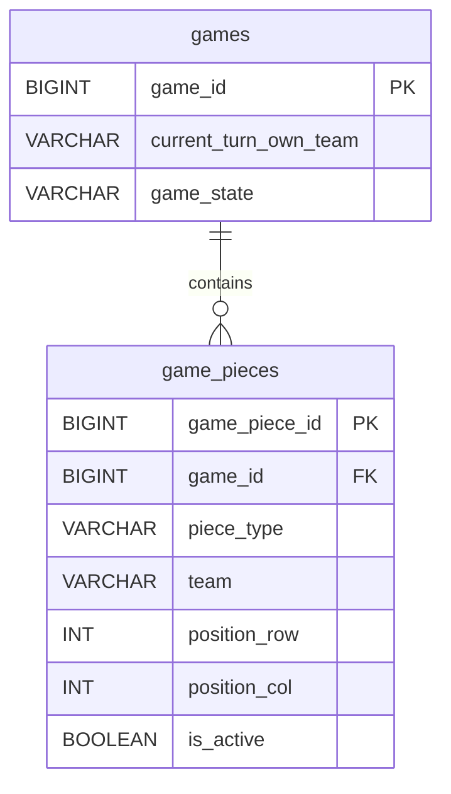

# java-janggi

장기 미션 저장소

# Database 설정

해당 프로그램에서는 데이터 영속성을 위해 다음과 같은 외부 저장소를 사용하고 있습니다.

- 기본 : `MySQL`
- 테스트 환경 : `H2(In-Memory)`, 별도의 설정 불필요

`Main.java`를 실행하려면 아래 두 가지 방법 중 하나를 선택하여 DB를 준비해야 합니다.

### 1. Docker를 이용한 빠른 시작 (권장)

터미널에서 아래 명령어를 실행하면 즉시 프로젝트 설정과 일치하는 MySQL 컨테이너가 구동됩니다.

```shell
docker run -d \
  --name mysql-db \
  --restart always \
  -e MYSQL_ROOT_PASSWORD=rootpassword \
  -e MYSQL_DATABASE=janggi \
  -p 3306:3306 \
  mysql:8.0
```

### 2. 로컬 DB 직접 설정 방법

이미 설치된 MySQL을 사용하거나 설정을 변경해야 한다면, 아래 경로의 파일을 수정하십시오.

**파일 경로:** `src/main/resources/database.properties`

```properties
db.url=jdbc:mysql://localhost:3306/janggi?useSSL=false&allowPublicKeyRetrieval=true&serverTimezone=UTC
db.username=root
db.password=rootpassword
```

- **`db.url`** : 데이터 베이스 접속 주소
- **`db.username`** : 데이터 베이스 사용자 이름
- **`db.password`** : 데이터 베이스 사용자에 맞는 비밀번호

# View

```shell
진행 중인 게임이 존재합니다. 계속 하시겠습니까? (y | n)
n

초나라와 한나라의 차림을 각각 선택하세요(콤마로 구분, 예시 => 1,3)
① 왼상차림 (상마상마), ② 오른상차림 (마상마상), ③ 안상차림 (마상상마), ④ 바깥상차림 (상마마상)
1,3
     a   b  c   d  e  f   g  h  i
   +------------------------------+
 1 | 차  마  상  사  궁  사  마  상  차 |
 2 | ．  ．  ．  ．  ．  ．  ．  ．  ． |
 3 | ．  포  ．  ．  ．  ．  ．  포  ． |
 4 | 졸  ．  졸  ．  졸  ．  졸  ．  졸 |
 5 | ．  ．  ．  ．  ．  ．  ．  ．  ． |
 6 | ．  ．  ．  ．  ．  ．  ．  ．  ． |
 7 | 兵  ．  兵  ．  兵  ．  兵  ．  兵 |
 8 | ．  包  ．  ．  ．  ．  ．  包  ． |
 9 | ．  ．  ．  ．  ．  ．  ．  ．  ． |
10 | 車  馬  象  士  漢  士  象  馬  車 |
   +------------------------------+
[현재 점수]
 - 초나라 : 72.0 점 
 - 한나라 : 73.5 점

초나라 차례입니다. 행동을 선택하세요.
1. 이동 2. 턴 넘기기
>> 1

초나라 이동할 기물의 위치와 이동할 위치를 입력하세요. (예: a7 a5)
>> a7 a5
잘못된 입력입니다. 다시 입력하세요.

... (중간 진행 과정 생략) ...

     a   b  c   d  e  f   g  h  i
   +------------------------------+
 1 | 차  마  상  사  궁  사  마  상  차 |
 2 | ．  ．  ．  ．  ．  ．  ．  ．  ． |
 3 | ．  포  ．  ．  ．  ．  ．  포  ． |
 4 | 졸  ．  졸  ．  ．  ．  졸  ．  졸 |
 5 | ．  ．  ．  ．  ．  ．  ．  ．  ． |
 6 | ．  ．  ．  ．  ．  ．  ．  ．  ． |
 7 | 兵  ．  兵  ．  ．  ．  兵  ．  兵 |
 8 | ．  包  ．  ．  ．  ．  ．  包  ． |
 9 | ．  ．  ．  ．  졸  ．  ．  ．  ． |
10 | 車  馬  象  士  漢  士  象  馬  車 |
   +------------------------------+
(점수 출력 생략)
초나라 차례입니다. 행동을 선택하세요.
1. 이동 2. 턴 넘기기
>> 1

초나라 이동할 기물의 위치와 이동할 위치를 입력하세요. (예: e9 e10)
>> e9 e10

     a   b  c   d  e  f   g  h  i
   +------------------------------+
 1 | 차  마  상  사  궁  사  마  상  차 |
 2 | ．  ．  ．  ．  ．  ．  ．  ．  ． |
 3 | ．  포  ．  ．  ．  ．  ．  포  ． |
 4 | 졸  ．  졸  ．  ．  ．  졸  ．  졸 |
 5 | ．  ．  ．  ．  ．  ．  ．  ．  ． |
 6 | ．  ．  ．  ．  ．  ．  ．  ．  ． |
 7 | 兵  ．  兵  ．  ．  ．  兵  ．  兵 |
 8 | ．  包  ．  ．  ．  ．  ．  包  ． |
 9 | ．  ．  ．  ．  ．  ．  ．  ．  ． |
10 | 車  馬  象  士  졸  士  象  馬  車 |
   +------------------------------+
(점수 출력 생략)

 초나라가 승리했습니다! 

```

# View

## InputView

- [x] 차림을 입력받는다.
- [x] 각 플레이어 턴의 행동을 입력받는다.
  ``` shell
  1. 이동 2. 턴 넘기기
  >> 1 
  ```
- [x] 이동할 기물과 위치를 입력받는다.

## ResultView

- [x] 장기판을 출력한다.
- [x] 선택에 따른 안내 문구를 출력한다.
- [x] 게임의 승자를 출력한다
- [x] 게임의 점수를 출력한다

# Controller

## JanggiController

- [x] 장기 게임의 입출력과 실행 흐름을 관리한다.

# Domain

## JanggiGame

- [x] 장기 게임의 흐름을 관리한다.
    - [x] 기물을 이동하는 명령을 내릴 수 있다
    - [x] 게임이 끝났는지 확인할 수 있다
    - [x] 게임의 승자를 찾아올 수 있다
    - [x] 게임의 점수를 구할 수 있다

## GameContext

- [x] 게임의 진행 상태(Playing, Finish 등)와 현재 턴을 중앙에서 관리한다.
- [x] 턴이 넘어갈 때 턴을 교체하는 로직을 수행한다.

## Turn

- [x] 초나라와 한나라 사이의 턴 관리를 담당한다.

## ScoreCalculator

- [x] 게임의 상태를 기반으로 팀별 점수를 구한다

## Board

- [x] 기물을 관리한다.
    - [x] 왕이 잡혔는지 아닌 지를 확인한다

## BoardInitializer

- [x] 차림에 맞게 기물 위치를 배치한다.

## PieceFactory

- [x] 도메인 생성의 복잡성을 캡슐화하여 알맞은 전략(Strategy)을 주입한 각 기물(Piece) 인스턴스들을 생성한다.

## Piece

- [x] 기물에 대한 정보를 소유한다.
- [x] 기물의 현재 위치에서 목적지까지 이동 가능한지 판단한다.

### 차 (Cha)

- [x] 가로 또는 세로 방향으로 원하는 칸 수만큼 이동한다.
- [x] 이동 경로에 아군 기물이 있으면, 해당 아군 기물 직전 칸까지만 이동한다.
- [x] 이동 경로에 상대 기물이 있으면, 해당 상대 기물 위치까지만 이동한다.

### 마 (Ma)

- [x] 직선 1칸 전진 후, 이동 방향의 대각선으로 1칸 이동한다.
- [x] 직선 1칸째 경로(목적지 미포함)에 기물이 있으면 이동할 수 없다.
- [x] 목적지에 아군 기물이 있으면 이동할 수 없다.
- [x] 목적지에 상대 기물이 있으면 해당 위치로 이동할 수 있다.

### 상 (Sang)

- [x] 직선 1칸 전진 후, 이동 방향의 대각선으로 2칸 이동한다.
- [x] 직선 1칸째 또는 대각선 1칸째 경로(목적지 미포함)에 기물이 있으면 이동할 수 없다.
- [x] 목적지에 아군 기물이 있으면 이동할 수 없다.
- [x] 목적지에 상대 기물이 있으면 해당 위치로 이동할 수 있다.

### 사 (Sa)

- [x] 상하좌우 방향으로 1칸 이동한다.
- [x] 목적지에 아군 기물이 있으면 이동할 수 없다.
- [x] 목적지에 상대 기물이 있으면 해당 위치로 이동할 수 있다.

### 포 (Po)

- [x] 가로 또는 세로 방향으로 이동한다.
- [x] 반드시 출발지와 목적지 사이의 기물(다리) 1개를 뛰어넘어야만 이동 및 공격이 가능하다.
- [x] 경로에 기물(다리)이 없거나 2개 이상이면 이동할 수 없다.
- [x] 목적지에 아군 기물이 있으면 이동할 수 없다.
- [x] 목적지에 상대 기물이 있으면 해당 위치로 이동할 수 있다.

### 졸 (Jol) / 병 (Byeong)

- [x] 앞으로 1칸, 또는 좌우로 1칸 이동한다.
- [x] 목적지에 아군 기물이 있으면 이동할 수 없다.
- [x] 목적지에 상대 기물이 있으면 해당 위치로 이동할 수 있다.

### 장 (Jang)

- [x] 상하좌우 방향으로 1칸 이동한다.
- [x] 목적지에 상대 기물이 있으면 해당 위치로 이동할 수 있다.

## Strategy

- [x] 장애물을 고려하지 않고 목적지까지 이동 가능한 경로를 제시한다.

### SlidingMoveStrategy

- [x] 상하좌우 직진 방향을 탐색 후, 목적지까지 이동 가능한 경로가 있다면 제시한다.

### SingleStepMoveStrategy

- [x] 상하좌우 한 칸씩 탐색 후, 목적지까지 이동 가능한 경로를 제시한다.

### JolMoveStrategy

- [x] 초 나라 기준 상좌우를 한 칸씩 탐색 후, 목적지까지 이동 가능한 경로를 제시한다.

### ByeongMoveStrategy

- [x] 한 나라 기준 상좌우를 한 칸씩 탐색 후, 목적지까지 이동 가능한 경로를 제시한다.

### MaMoveStrategy

- [x] 상하좌우 직진 방향으로 한 칸 이동 후, 해당 방향의 대각선으로 한 칸 이동하여 목적지까지의 경로를 제시한다.

### SangMoveStrategy

- [x] 상하좌우 직진 방향으로 한 칸 이동 후, 해당 방향의 대각선으로 두 칸 이동하여 목적지까지의 경로를 제시한다.

### PalaceMoveStrategy

- [x] PalaceMoveRule을 이용해서 궁성 내 이동 가능성을 파악한 후, 빈 List를 반환한다

### PalaceMoveRule

- [x] 대각선으로 이동 가능성, 직선 이동 가능 경로를 모두 탐색 후 이동 가능한 경로가 있는지 없는지에 대해 제공한다

# Service

## JanggiGameService

- [x] 새로운 게임을 생성하고 저장한다
- [x] 진행 중인 게임들을 불러오거나 관리한다
- [x] 진행 중인 모든 게임을 포기(종료) 처리한다
- [x] 기물을 이동시키고 DB에 반영한다
- [x] 턴을 넘기고 DB에 상태를 반영한다

# Repository

## JdbcConnectionGenerator

- [x] 설정 정보를 바탕으로 Database와의 Connection을 제공한다

## JdbcTemplate

- [x] Jdbc를 사용하는 과정에서 발생하는 공통된 로직을 공통으로 관리한다

## GameJdbcRepository

- [x] 단일 Game을 잘 저장한다
- [x] 하나의 Game을 id로 잘 찾아온다
- [x] Game 정보를 잘 수정한다
- [x] 상태를 기반으로 진행 중인 게임을 찾아온다

## GamePieceJdbcRepository

- [x] 하나의 GamePiece를 잘 저장한다
- [x] 여러 GamePiece들을 배치(Batch)로 잘 저장한다
- [x] 특정 게임(game_id)의 전체 GamePiece들을 잘 찾아온다
- [x] GamePiece 데이터(위치 업데이트, 잡힘 여부) 변경이 잘 된다

# Database ERD


```mermaid
erDiagram
    games ||--o{ game_pieces : "contains"

    games {
        BIGINT game_id PK
        VARCHAR current_turn_own_team
        VARCHAR game_state
    }
    
    game_pieces {
        BIGINT game_piece_id PK
        BIGINT game_id FK
        VARCHAR piece_type
        VARCHAR team
        INT position_row
        INT position_col
        BOOLEAN is_active
    }
```
