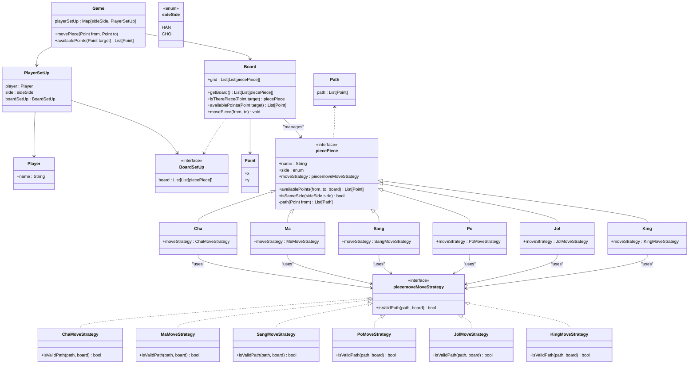

# java-janggi

장기 미션 저장소

---

## 장기

### 기물

| 기물	 | 한자 (초) | 	한자 (한) |
|-----|--------|---------|
| 궁   | 	楚	    | 漢       |
| 차   | 	車	    | 車       |
| 포   | 	包	    | 包       |
| 마   | 	馬	    | 馬       |
| 상   | 	象	    | 象       |
| 사   | 	士	    | 士       |
| 졸/병 | 	卒	    | 兵       |


### 기물 행마법

각 기물은 고유한 이동 규칙을 가지며, 경로에 따라 이동 가능 여부가 결정된다

- 차(Chariot) : 전후좌우 직선 이동 + 궁성 내 대각선 이동 (다른 기물을 넘을 수 없음)
- 포(Cannon) : 기물 하나를 넘어 전후좌우 직선 이동 + 포끼리는 넘거나 잡기 불가 + 궁성 내 대각선 이동
- 마(Horse) : 직선 한 칸 & 대각선 한 칸 이동 (다른 기물을 넘을 수 없음)
- 상(Elephant) : 직선 한 칸 & 대각선 두 칸 이동 (다른 기물을 넘을 수 없음)
- 졸/병(Soldier) : 전진 및 좌우 직선 한칸 이동 + 궁성 내 대각선 전진 이동 (후진 불가능)
- 사(Advisor) : 궁성 내에서만 선을 따라 한 칸 이동
- 궁(General) : 궁성 내에서만 선을 따라 한 칸 이동


[//]: # (### 승패 판단)
[//]: # (step2 에서 진행)


---

## 게임 흐름
```
게임 시작
    ↓
진영 (이름, 진영)
    ↓
기물 차림(한 -> 초 순서로)

----↓----

순서(초 -> 한)에 따른 게임 진행
ex) 기물들 이동, 잡기

----↓----
승패 판단
    
```
승패 판단은 step2에서 진행한다

---

## 기능 목록

###  Game

- 게임을 시작하고 전체 흐름을 관리한다
- 기물 이동 요청을 처리한다
- 특정 기물의 이동 가능 위치를 조회한다


###  Board

- 장기판의 상태(기물 배치)를 관리한다
- 특정 위치의 기물을 조회한다
- 기물의 이동 가능 위치를 계산한다
- 기물을 실제로 이동시킨다
- 같은 진영 기물이 있는 위치로 이동하지 못하도록 제한한다


###  piecePiece

- 기물의 기본 속성(이름, 진영)을 가진다
- 자신의 이동 규칙에 따라 이동 가능한 위치를 계산한다
- 같은 진영 여부를 판단한다


###  piecemoveMoveStrategy

- 기물 이동 경로가 유효한지 검증한다
- 기물별 이동 제약 조건을 처리한다
  (예: 경로 차단, 점프 여부 등)


###  Path

- 기물의 이동 경로를 표현한다
- 이동 중간 경로 검증에 사용된다


###  Point

- 장기판의 좌표를 표현한다


###  PlayerSetUp
* Player
  - 플레이어 정보를 관리한다
* sideSide
  - 플레이어의 진영을 설정한다 
* BoardSetup
  - 장기판의 초기 기물 배치를 생성한다

---

## 클래스 다이어그램

```mermaid
classDiagram
    direction TB

    %% 상단: 게임과 전체 구조
    class Game {
        playerSetUp : Map[sideSide, PlayerSetUp]
        +movePiece(Point from, Point to)
        +availablePoints(Point target) List[Point]
    }

    class PlayerSetUp {
        player : Player
        side : sideSide
        boardSetUp : BoardSetUp
    }

    class Player {
        +name : String
    }

    class BoardSetUp {
        <<interface>>
        board : List[List[piecePiece]]
    }

    class Board {
        +grid : List[List[piecePiece]]
        +getBoard() List[List[piecePiece]]
        +isTherePiece(Point target) piecePiece
        +availablePoints(Point target) List[Point]
        +movePiece(from, to) void
    }

    class Point {
        +x
        +y
    }

    class Path {
        path : List[Point]
    }

    class sideSide {
        <<enum>>
        HAN
        CHO
    }

    %% 중간: 추상 피스 및 전략 구조
    class piecePiece {
        <<interface>>
        +name : String
        +side : enum
        +moveStrategy : piecemoveMoveStrategy
        +availablePoints(from, to, board) List[Point]
        +isSameSide(sideSide side) bool
        -path(Point from) List[Path]
    }

    class piecemoveMoveStrategy {
        <<interface>>
        +isValidPath(path, board) bool
    }

    %% 하단: 기물 및 전략 구현체
    class Cha {
        +moveStrategy : ChaMoveStrategy
    }
    class Ma {
        +moveStrategy : MaMoveStrategy
    }
    class Sang {
        +moveStrategy : SangMoveStrategy
    }
    class Po {
        +moveStrategy : PoMoveStrategy
    }
    class Jol {
        +moveStrategy : JolMoveStrategy
    }
    class King {
        +moveStrategy : KingMoveStrategy
    }

    class ChaMoveStrategy {
        +isValidPath(path, board) bool
    }
    class MaMoveStrategy {
        +isValidPath(path, board) bool
    }
    class SangMoveStrategy {
        +isValidPath(path, board) bool
    }
    class PoMoveStrategy {
        +isValidPath(path, board) bool
    }
    class JolMoveStrategy {
        +isValidPath(path, board) bool
    }
    class KingMoveStrategy {
        +isValidPath(path, board) bool
    }

    %% 관계선
    Game --> PlayerSetUp
    Game --> Board
    PlayerSetUp --> Player
    PlayerSetUp --> BoardSetUp
    Board ..> BoardSetUp
    Board --> piecePiece : "manages"
    Board --> Point
    Path <.. piecePiece
    piecePiece <|-- Cha
    piecePiece <|-- Ma
    piecePiece <|-- Sang
    piecePiece <|-- Po
    piecePiece <|-- Jol
    piecePiece <|-- King

    Cha --> piecemoveMoveStrategy : "uses"
    Ma --> piecemoveMoveStrategy : "uses"
    Sang --> piecemoveMoveStrategy : "uses"
    Po --> piecemoveMoveStrategy : "uses"
    Jol --> piecemoveMoveStrategy : "uses"
    King --> piecemoveMoveStrategy : "uses"

    piecemoveMoveStrategy <|.. ChaMoveStrategy
    piecemoveMoveStrategy <|.. MaMoveStrategy
    piecemoveMoveStrategy <|.. SangMoveStrategy
    piecemoveMoveStrategy <|.. PoMoveStrategy
    piecemoveMoveStrategy <|.. JolMoveStrategy
    piecemoveMoveStrategy <|.. KingMoveStrategy
```
