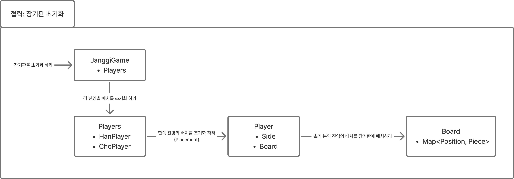
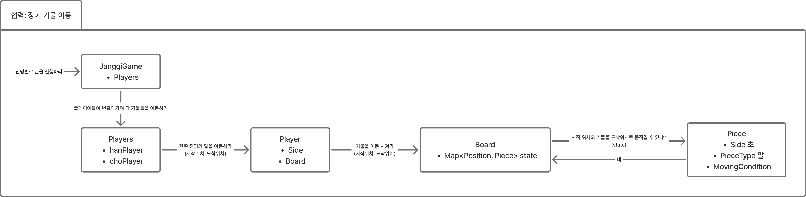
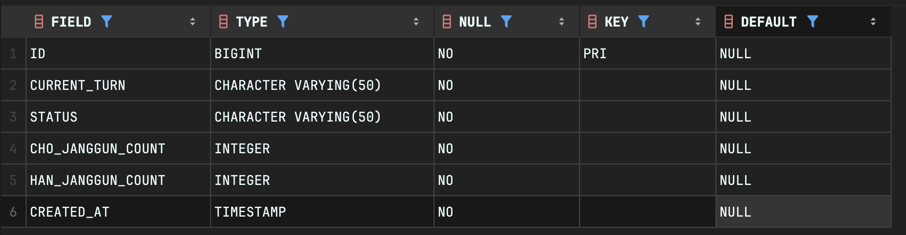
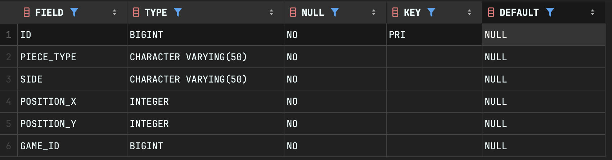

# java-janggi

장기 미션 저장소

## 역할, 책임, 협력

## 기능 요구사항

### 1-1. 보드 초기화

협력명: 장기판을 초기화 한다.

필요한 메시지(행동)
- 장기판을 초기화 하라
- 각 진영별 배치를 초기화 하라
- 진영별 배치를 선택하라
- 선택한 배치대로 기물들을 배치하라

#### 시나리오
1. 장기 게임을 초기화 한다. - JanggiGame
2. 진영별 배치를 선택한다. - Player
3. 진영에 맞는 기물 타입의 기물을 생성한다. - Piece
4. 각 진영별 기물 배치를 초기화한다. - Board

#### 각 메시지(행동)에 따른 책임을 부여한 객체
#### JanggiGame
- [x] 장기 게임을 초기화 한다.
- Board
- Players

#### Players
- [x] 각 플레이어별 
- 진영 side ENUM

#### Player
- [x] 진영별 배치를 선택한다.
- 진영 side ENUM
- Board

#### Board
- [x] 각 진영별 기물 배치를 초기화한다.
- Map<Position, Piece>
- MAX_ROW
- MIN_ROW
- MAX_COLUMN
- MIN_COLUMN

#### Piece
- [x] 기물 타입의 기물을 생성한다.
- 진영 side ENUM
- 기물 종류 type ENUM

#### Position
- row
- column

### 1-2. 기물 이동

협력명: 장기 기물을 이동한다.

### 이동 규칙

공통 규칙

- 보드판을 벗어날 수 없다.
- 본인 진영의 말만 이동 시킬 수 있다.
- 상대 진영의 말이 있는 칸으로 이동하면 포획할 수 있다.
- 본인 진영의 말이 있는 칸으로 이동할 수 없다.

시나리오

이동 실패 케이스

1. 1,9에 초 진영의 차가 배치되어 있다.
2. 1,9의 초 진영의 차를 1,10 위치로 이동시킨다.
3. 이동에 실패한다.

이동 실패 케이스

1. 초 플레이어의 턴이다.
2. 10,9에 한 진영의 차가 배치되어 있다.
3. 초 플레이어가 10,9의 말을 이동시킨다.
4. 이동에 실패한다.

이동 실패 케이스

1. 초 플레이어의 턴이다.
2. 1,9에 초 진영의 차, 4,9에 초 진영의 졸이 배치되어 있다.
3. 초 플레이어가 1,9의 차를 4,9의 위치로 이동시킨다.
4. 이동에 실패한다.

#### 졸

기본 조건: 
- 본인 진영 기준에서 앞으로 또는 옆으로 한칸 이동며 잡거나 이동할 수 있다.
- 뒤로는 이동 할 수 없다.

- 끝에 도달하면 옆으로만 이동할 수 있다.
- 적 진영 궁궐 안에서는 대각선으로 이동할 수 있다.

시나리오
포획 성공 케이스

1. 4,1에 초 진영의 졸, 5,1에 한 진영의 졸이 배치되어 있다.
2. 초 진영이 4,1의 졸을 5,1 위치로 이동 시킨다.
3. 5,1에 있던 한 진영의 졸이 죽는다.

이동 성공 케이스

1. 4,1에 초 진영의 졸, 5,1에 한 진영의 졸이 배치되어 있다.
2. 초 진영이 4,1의 졸을 5,1 위치로 이동 시킨다.
3. 5,1에 있던 한 진영의 졸이 죽는다.

이동 실패 케이스

1. 4,1에 초 진영의 졸이 배치되어 있다.
2. 초 진영이 4,1의 졸을 3,1 위치로 이동 시킨다.
3. 이동에 실패한다.

1. 7,1에 한 진영의 졸이 배치되어 있다.
2. 초 진영이 7,1의 졸을 8,1 위치로 이동 시킨다.
3. 이동에 실패한다.

### 차

기본 조건: 수평, 수직 직선으로만 이동하며 말을 잡을 수 있다.

- 궁권 안쪽에서는 대각선 방향으로 이동할 수 있다.

시나리오

이동 성공 케이스

1. 1,9에 초 진영의 차 4,9에 초 진영의 졸이 배치되어 있다.
2. 초 진영이 1,9의 차를 3,9 위치로 이동 시킨다.
3. 1,9에 있던 초 진영의 차가 3,9 위치로 이동된다.

포획 성공 케이스

1. 1,9에 초 진영의 차 7,9에 한 진영의 졸이 배치되어 있다.
2. 초 진영이 1,9의 차를 7,9 위치로 이동 시킨다.
3. 7,9에 있던 한 진영의 졸이 죽는다.

이동 실패 케이스

1. 1,9에 초 진영의 차 4,9에 초 진영의 졸이 배치되어 있다.
2. 초 진영이 1,9의 차를 6,9 위치로 이동 시킨다.
3. 이동에 실패한다.

이동 실패 케이스

1. 1,9에 초 진영의 차가 배치되어 있다.
2. 초 진영이 1,9의 차를 2,8 위치로 이동 시킨다.
3. 이동에 실패한다.

### 마

기본 조건: 상하좌우 중 하나 이동 후 대각선 방향으로 한칸 바깥으로 이동한다.

- 첫번째 이동할 경로에 다른 말이 있으면 그 방향으로 이동할 수 없다.

시나리오

이동 성공 케이스

1. 1,7에 초 진영의 마가 배치되어 있다.
2. 초 진영이 1,7의 마를 3,6 위치로 이동 시킨다.
3. 이동 할 수 있다.

포획 성공 케이스

1. 4,4에 초 진영의 마, 6,5에 한 진영의 졸이 배치되어 있다.
2. 초 진영이 4,4의 마를 6,5 위치로 이동 시킨다.
3. 6,5에 초 진영의 마가 있다.

이동 실패 케이스

1. 1,7에 초 진영의 마가 2,7에 한 진영의 졸이 배치되어 있다.
2. 초 진영이 1,7의 마를 3,6 위치로 이동 시킨다.
3. 이동할 수 없다.

이동 실패 케이스

1. 1,7에 초 진영의 마가 배치되어 있다.
2. 초 진영이 1,7의 차를 3,7 위치로 이동 시킨다.
3. 이동에 실패한다.

### 상

기본 조건: 상하좌우 중 하나 이동 후 대각선 방향으로 두 칸 이동하여 2X3 직사각형 반대쪽 모서리에 도착한다.

- 중간에 있는 말에 막히면 점프할 수 없다.

시나리오

이동 성공 케이스

1. 1,8에 초 진영의 상이 배치되어 있다.
2. 초 진영이 1,8의 상을 4,6 위치로 이동 시킨다.
3. 이동 할 수 있다.

포획 성공 케이스

1. 4,6에 초 진영의 상, 7,4에 한 진영의 졸이 배치되어 있다.
2. 초 진영이 4,6의 상을 7,4 위치로 이동 시킨다.
3. 7,4에 초 진영의 상이 있다.

이동 실패 케이스

1. 1,8에 초 진영의 상과 2,8에 한 진영의 졸이 배치되어 있다.
2. 초 진영이 1,8의 상을 4,6 위치로 이동 시킨다.
3. 이동할 수 없다.

이동 실패 케이스

1. 1,8에 초 진영의 상이 배치되어 있다.
2. 초 진영이 1,8의 상를 3,8 위치로 이동 시킨다.
3. 이동에 실패한다.

### 사

기본 조건: 궁궐 내에서만 이동 가능 하며, 한 칸 씩 만 이동할 수 있다.

시나리오

이동 성공 케이스

1. 1,4에 초 진영의 사가 배치되어 있다.
2. 초 진영이 1,4의 사를 2,4 위치로 이동 시킨다.
3. 이동이 가능하다

포획 성공 케이스

1. 1,4에 초 진영의 사, 2,4오 한 진영의 졸이 배치되어 있다.
2. 초 진영이 1,4의 사를 2,4 위치로 이동 시킨다.
3. 2,4에는 초 진영의 사가 있다.

### 장

기본 조건: 궁궐 내에서만 이동 가능 하며, 한 칸 씩 만 이동할 수 있다.

- 상대 진영에게 잡히면 해당 진영은 게임을 패배한다.

시나리오

이동 성공 케이스

1. 2,5에 초 진영의 장이 배치되어 있다.
2. 초 진영이 2,5의 장을 1,5 위치로 이동 시킨다.
3. 이동이 가능하다.

포획 성공 케이스

1. 2,5에 초 진영의 장, 3,5에 한 진영의 졸이 배치되어 있다.
2. 초 진영이 2,5의 장을 3,5 위치로 이동 시킨다.
3. 3,5에는 초 진영의 장이 있다.

### 포

기본 조건: 말을 하나 띄어넘어 잡거나 이동할 수 있다.

- 궁궐 안에서는 대각선으로 이동할 수 있다.
- 뛰어넘는 상대 말이 포가 될수 없다.
- 포끼리는 잡을 수 없다.

구체적인 규칙
- Direction은 차 처럼 직선만 있어야 한다.
- 가는 경로에 기물이 1개만 있어야 한고, 해당 기물은 포가 아니여야 한다.
- 도착 경로에 기물은 포가 아니어야 한다.

시나리오

이동 성공 케이스 (본인 진영의 말을 띄어넘어 빈칸으로 이동)

1. 3,8에 초 진영의 포가 배치되어 있고, 4,8에 초 진여의 졸이 배치되어 있다.
2. 초 진영이 3,8의 포를 6,8 위치로 이동 시킨다.
3. 이동 할 수 있다.

이동 성공 케이스 (본인 진영의 말을 띄어넘어 상대방 말로 이동)

1. 3,8에 초 진영의 포가 배치되어 있고, 4,8에 초 진영의 졸, 10,8에 한 진영의 마가 배치되어 있다.
2. 초 진영이 3,8의 포를 10,8 위치로 이동 시킨다.
3. 이동 할 수 있다.

이동 성공 케이스 (상대방 진영 말을 띄어넘어 빈칸으로 이동)

1. 3,8에 초 진영의 포가 배치되어 있고, 5,8에 한 진영의 졸이 배치되어 있다.
2. 초 진영이 3,8의 포를 10,8 위치로 이동 시킨다.
3. 이동 할 수 있다.

이동 성공 케이스 (상대방 진영의 말을 띄어넘어 상대방 말로 이동)

1. 3,8에 초 진영의 포가 배치되어 있고, 4,8에 한 진영의 졸, 10,8에 한 진영의 마가 배치되어 있다.
2. 초 진영이 3,8의 포를 10,8 위치로 이동 시킨다.
3. 이동 할 수 있다.

포획 성공 케이스

1. 초 진영과 한 진영은 왼쪽 코끼리 배치이다.
2. 10,7의 한진영 마가 8,6으로 이동한다.
3. 8,8의 한 진영 포가 8,5으로 이동한다.
4. 7,9의 한 진영 졸이 7,8로 이동한다. (given)
5. 초 진영이 3,8의 포를 10,8 위치로 이동 시킨다. (when)
6. 10,8에는 초 진영의 포가 배치되어 있다. (then)

이동 실패 케이스 (직선의 경로가 아닌 경우)

1. 3.8에 초 진영의 포가 배치되어 있다.
2. 초 진영이 3,8의 포를 5,7 위치로 이동 시킨다.
3. 이동할 수 없다.

이동 실패 케이스 (가는 경로에 기물이 1개 초과일 경우)

1. 3.8에 초 진영의 포, (4,8) (5,8)에 초진영 졸아 배치되어 있다.
2. 초 진영이 3,8의 포를 7,8 위치로 이동 시킨다.
3. 이동할 수 없다.

이동 실패 케이스 (가는 경로의 기물이 1개 있는데 해당 기물이 포일 경우)

1. 3.8에 초 진영의 포, 8,8에 한 진영 포가 배치되어 있다.
2. 초 진영이 3,8의 포를 10,8 위치로 이동 시킨다.
3. 이동할 수 없다.

이동 실패 케이스 (도착 지점이 상대방 포일 경우)

1. 3.8에 초 진영의 포, 4,8에 초 진영 졸, 8,8에 한 진영 포가 배치되어 있다.
2. 초 진영이 3,8의 포를 8,8 위치로 이동 시킨다.
3. 이동할 수 없다.

이동 실패 케이스 (가는 경로에 기물이 1개도 없는 경우)

1. 3.8에 초 진영의 포가 배치되어 있다.
2. 초 진영이 3,8의 포를 4,8 위치로 이동 시킨다.
3. 이동할 수 없다.

### 필요한 메시지 (행동)

- 플레이어들이 번갈아가며 각 기물들을 이동하라 JanggiGame
- 한쪽 진영의 말을 이동하라 (시작위치 → 도착위치) Player
- 기물을 이동시켜라 (시작위치 → 도착위치) Board
- 시작 위치의 기물을 도착위치로 움직일 수 있는지 알려줘 Piece

---
# 사이클 2

## 기능 요구사항

### 궁성 영역 구현
- 궁성 영역 좌표
  - (3,4),(3,5),(3,6)
  - (2,4),(2,5),(2,6)
  - (1,4),(1,5),(1,6)
- 궁, 사는 궁성 내부에서만 이동할 수 있으며 궁성을 벗어날 수 없다.
- 궁성 내 대각선 경로가 연결된 위치에 있는 기물은 대각선으로 이동할 수 있다.
  - 궁성 대각선 이동 규칙은 궁, 사, 차, 포, 졸에 적용한다.
  - 상과 마는 궁성 여부와 관계없이 기존 이동 규칙만 따른다.
- 차와 포는 궁성 내 대각선 경로를 따라 이동할 수 있다.
  - 차와 포가 궁성 내 대각선 경로를 이용해 이동하는 경우, 목적지는 반드시 궁성 내부여야 한다.

### 게임 종료조건
- 궁이 잡히는 경우
- 어느 한 진영이 장군 상태가 5번 반복될 경우 -> `빅장` 이라고 함
  - 점수를 계산하여 승패 판단

### 점수계산 (빅장 시)
- 후수(한)가 1.5점을 핸디캡으로 받고 시작
- 남아 있는 기물의 점수를 계산
- 기물의 점수
  - 차: 13점
  - 포: 7점
  - 마: 5점
  - 상: 3점
  - 사: 3점
  - 졸: 2점
  - 궁: 0점

### DB 적용

장기 게임을 한 번의 실행으로 끝내지 않고, 진행 중인 상태를 저장하고 다시 불러오기 위해 DB를 적용

현재 DB에는 다음 정보를 저장

- `game` 테이블
  - 게임의 고유번호
  - 게임의 상태(`WAITING_HAN_PLACEMENT`, `WAITING_CHO_PLACEMENT`, `IN_PROGRESS`, `FINISHED`)
  - 현재 턴
  - 초/한 장군 횟수
  - 생성 시간

- `board` 테이블
  - 기물의 고유번호
  - 기물 종류
  - 진영
  - 현재 위치 (x, y)
  - 어떤 게임에 속한 기물인지에 대한 game_id

#### 저장 시점
- 저장된 게임이 없어 새로운 게임을 만들 때
- 기물이 움직였을 때
- 초 or 한 이 장군상태가 되었을 때
- 턴이 넘어갔을 때
- 진행 상태가 변경될 때
  - 초기 상태 -> 한 진영 상차림 대기 상태
  - 한 진영이 상차림을 마쳤을 때 -> 초 진영 상차림 대기 상태
  - 초 진영이 상차림을 마쳤을 때 -> 게임 진행 상태
  - 게임이 끝났을 때 -> 게임 종료 상태
-
