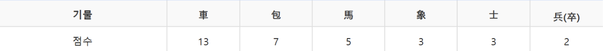

# 미션 중 기록

### 1. 상태 위치를 결정할 때 고민한 순간 1회

이동 규칙을 Board가 관리해야할 지, Piece가 관리해야할 지 고민이 많았습니다.   

결론부터 말하자면 저는 장기에서 Piece란 수동적인 객체로 인식했습니다.   
가장 큰 이유는 기물이 자신의 위치를 모르기 때문입니다.   

- `참고`: 위치(좌표)는 Board가 관리하는 것이 맞다고 판단

이동 규칙은 어떤 기물인지도 중요하지만, 어느 칸에 어느 기물이 있는지 아는 것이 더 중요하다고 생각했습니다.   
Piece가 이동 규칙을 가지는 설계에서는 Board -> Piece -> Board -> 이동의 형태로 계속 메서드를 주고받는 불필요함이 생기는 걸 확인할 수 있었습니다.   

이런 불편함을 감수하고도 Piece가 이동규칙을 가져야하는 설계까 정답인가? 라는 의문이 들었습니다.   
또한 기물의 이동이 객체 외부의 상태에 결정된다는 것이 어색하게 느껴지기도 했습니다.   

PR에 매우 자세히 기록을 남겨두었습니당!

### 2. 불변/캡슐화를 적용한 코드 1곳

이동 규칙에서 List<Intersection>이 자주 사용되는 것을 관찰할 수 있었습니다.   
또한 각 기물의 이동규칙에서 이 List<Intersection>을 사용해서 중복되는 검증 로직을 수행하고 있었습니다.   
ex (도착지가 같은 팀 인지, 경로에 장애물이 있는 지)   
이렇게 자주 사용되는 List<Intersection>과 반복적으로 수행되는 메서드를 하나의 객체로 인식하여 캡슐화하였습니다.   

그 결과 List 컬렉션이 메서드 파라미터로 주고 받는 대신 Path라는 경로 객체가 메서드를 지나다니게 되었습니다.   
기존에는 `(List<Intersection> path)`로 타입만으로는 어떤 역할을 하는 지 이해하기 힘들었다면,   
Path로 한 번 감싸게 되니 `(Path path)`를 사용하여 보다 직관적으로 메서드 시그니처를 이해할 수 있었습니다.

더 나아가, 출발지, 경로, 도착지를 Path에 묶어서 총 경로를 캡슐화하여 관리하도록 했습니다.   
다만 아쉬운 점은 포 같은 특수한 이동 규칙을 가진 경우, CannonMoveRule이 이를 직접 검증하도록 하기 위해 Path의 List<Intersection>을 반환하도록 설계했습니다.

### 3. 규칙 적용으로 변경한 설계 1곳

사전 학습 단계에서는 상차림(상마상마)를 전혀 고려하지 않고 File로 장기판의 상태를 받아 구현하려고 했습니다.     
그러나 실제 장기에서 `초`와 `한`팀에세 각각 상차림을 물어보고 기물이 세팅된다는 규칙을 뒤늦게 알게되었습니다.   
이 때문에 File(csv)로 장기판을 입력받기 보다는 사용자에게 각각 Formation을 입력받아 상차림을 적용하는 식으로 재설계했습니다.   

### 4. 조건문을 다형성으로 대체한 코드 1곳

기존에는 PieceType.values()와 if문을 통해 기물에 맞는 이동 규칙을 찾아야하는 번거로움이 존재했습니다.   
그러나 각 PieceType을 가지는 MoveRule로 이동 규칙을 추상화하여 각각의 MoveRule을 하나의 부모 타입으로 가질 수 있었습니다.   

이를 List<MoveRule>을 filter로 찾아내는 식으로 활용하 if문을 제거할 수  있었습니다.
아마찌의 피드백을 받아 List보다는 Map<PieceType, MoveRule> 컬렉션을 사용해 이동 규칙을 찾는 책임을 분리하고 조회 성능을 개선했습니다.   

### 5. 인터페이스/추상 클래스를 도입한 이유

각각의 이동 규칙은 제마다 다른 이동 방향과 검증 조건을 가집니다.   
그러나 이동을 하기 위해서 각각의 기물들은 다음 두가지 행위를 진행해야 합니다.   

1. 자신의 이동방향으로만 갈 수 있는 지 확인 (장애물 검사x)
2. 이동 경로에 장애물 조건등을 검사

위 중복되는 행위를 하나로 묶고, 이동을 위해 필히 수행해야하는 위 동작의 시행을 보장하기 위해 인터페이스를 도입했습니다. (전략패턴)

### 6. 새 기물 추가 시 변경 범위 테스트 (가상으로)

1. PieceType에 새 기물 타입 추가
2. IntersectionGenerator에 새 기물의 초기 위치 추가
3. XXXMoveRule 클래스 추가
4. MoveRuleManager에 <PieceType, XXXMoveRule> 추가

# 사이클 2 - 미션 중 기록

### 1. 기능 추가로 인해 수정한 위치 개수

- 궁성 구현으로 인해 수정한 위치 개수
  - 차, 포, 졸, 사, 궁의 이동 규칙에 궁성인지 확인 후, Directions를 추가하는 로직을 적용했습니다.
  - 졸병의 경우, 각 팀마다 전진 방향이 존재, 소유한 Directions에 전진 방향만 남도록 하는 `forward` 메서드를 적용했습니다.

- 점수 기능
  - JanggiBoard에서 isGameOver() 수정. 각 팀의 점수가 30점 미만인 경우, 게임을 중단하고 점수제로 승자를 판단하도록 수정했습니다.

- DB 저장
  - 이동 후, 출발과 도착지 Intersection을 update하기 위해 이를 `Moved` 반환하도록 수정했습니다.
  - 어떤 JanggiBoard의 Intersection을 수정해야하는 지 알기 위해서는 JanggiBoard의 PK가 필요합니다. 
    - BoardIdConext를 만든 뒤, 장기게임 생성 혹은 이어서 할 경우, BoardId를 Context에 set하고 종료 시 clear 되도록 Controller를 수정했습니다.

### 2. 사이클1 때보다 수정 범위가 줄었는가/늘었는가

우선 DB 기능 추가로 인한 수정 범위는 꽤 컸다고 생각합니다.      
currentTurn을 Board 내부로 옮기는 과정에서 Controller, Domain 그리고 테스트 코드까지 변경이 전파되었기 때문입니다.   
도메인 관점에서 현재 누구의 턴인지 Board가 알고 있는 것이 좋을 것 같다고 나중에 생각하게 되었는데, 이런 부분이 DB 기능에서 크게 작용할 지 생각하지는 못했습니다.   
> 왜 DB 기능이 추가되면서 currentTurn이 Board로 옮기는 것이 나은 선택이었는가?   
> 위 고민에 대해서, 객체가 가지는 상태를 판단하는 게 중요하다고 느꼈습니다.

궁성 기능을 추가로 인한 수정 범위는 `중`이라고 생각합니다.   
Intersection을 추상화하고 각각의 Palace를 새롭게 추가 했습니다.   
그러나, 각각의 이동 규칙에, 추가 Directions을 반영해주는 변경만 있었을 뿐, 기존 코드 변경이 그렇게 많다고 생각하지는 않았습니다.   

점수 기능으로 인한 추가 수정 범위는 `하`입니다.
PieceType에 점수를 추가하지 않고 PieceScore를 추가로 생성했으며, 이에 대한 점수 계산 로직만 추가했기 때문입니다.

### 3. 도메인과 저장소를 분리한 코드 1곳

저장소와 관련있는 `DAO`, `Mapper`, `TransactionExecutor` 모두 JanggiService에서 사용할 뿐, JanggiGame, JanggiBoard같은 도메인에서는 알 수 없도록 했습니다.   
저장소에서 발생하는 예외(SQLException)은 도메인 상위 예외(JanggiException)와 관련이 없다고 생각하여, 별도의 DataAccessException을 만들어 사용할 예정입니다!   

추가적으로 저장소 내부에서도, Connection 관리를 분리했습니다.   
그리고 Dao는 어떤 쿼리와 파라미터 그리고 rowMapper를 사용하는 지에 집중할 수 있도록 하고, 실제 매핑 로직은 JdbcTemplate에서 수행할 수 있도록 분리했습니다.

### 4. DB 변경 시 도메인 코드 영향 분석

현재 JdbcTemplate를 추상화하는 과정에 있고, 표준 SQL을 사용하기 때문에 DB가 변경되어도 도메인 코드에 크게 영향이 있을 것이라 생각하지는 않습니다!   
DB가 변경된다면 변경된 DB에 연결하기 위한 `Driver`와 `DB_URL`이 핵심적으로 변경되어야 합니다.   
그러나, 도메인과 저장소를 분리해놓았기 때문에, DB를 변경한다고 하더라도 괜찮을 것 같습니다.    

### 5. 규칙 적용으로 변경한 코드 1곳

- JanggiBoard가 currentTurn을 가지도록 수정

기존에는 JanggiGame에서 currentTurn을 관리했습니다.   
tryToMove() 호출이 끝나면 currentTurn.nextTurn; 을 사용했습니다.
그러나, 중단되었던 게임을 이어서 하는 기능을 위해, JanggiBoard가 currentTurn을 가지도록 수정하게 되었습니다.

누구의 Turn으로 이어서 장기를 시작하게 하려면 JanggiBoard 객체가 가지고 있고, 스스로 턴을 넘기는 방식이 적합하다고 생각했기 때문입니다.   

> 더 나아가 상태패턴을 적용해볼 수 있을 것 같습니다. 단순히 Turn 뿐만 아니라, JanggiBoard가 종료되면 누구의 승리인지 HanWin, ChoWin의 상태를 지니는 객체를 만들고, 이를 Turn과 같은 조상을 상속하도록합니다.   
> 이런 상태 패턴을 JanggiBoard에 적용하면 DB 컬럼도 하나로 줄일 수 있어 효과적일 것 같습니다.

### 6. 아쉬운 점.

- 스스로 정한 PR 제출 시간을 지키지 못한 점. 

초기 구현 코드에서 dao의 try-with-resource와 pstmt.setSring()과 같은 반복되는 로직을 관찰할 수 있었습니다.   
이를 실제 JdbcTemplate과 비슷한 형태로 개선시켜보고자 노력했습니다.   
다만, 함수형 인터페이스에 대해 지식이 조금 부족하여, 시간이 걸렸습니다.
특히, 빠르게 PR을 올려 피드백을 요청받고자 다짐했지만, 코드가 만족스럽지 못해, 스스로 정한 PR 제출 시간을 지키지 못한 점이 너무 아쉽습니다.

- 자원 관리의 미숙함.
위에서 말한 코드 리팩토링 과정을 거치면서, PreparedStatement나 ResultSet같은 자원을 해제하는 걸 빼먹은 게 아쉽습니다.   
가볍게 어플리케이션을 돌리면서 잘 되는 지 확인만 하다 보니, 리소스 누수를 직접 체감하지 못한 탓도 있는 것 같습니다.

# 사이클1 - 기능 요구사항

### Point
- [ ] (0, 0)의 기준은 왼쪽 위. 
- [ ] 수직 선은 9개 
- [ ] 수평 선은 10개
- [ ] (0,0) ~ (9,8)

### Team
- [ ] ‘초’와 ‘한’팀이 존재한다.

### 기물
- [ ] ‘마’, ‘상’, ‘차’, ‘포’, ‘졸’, ‘사’, ‘장군’ 총 7개의 기물이 존재한다.

### 포진
- [ ] 상과 마의 포진을 선택할 수 있다. 
  - [ ] 상마상마, 상마마상, 마상마상, 마상상마로 총 4가지이다. 
  - [ ] ‘초’와 ‘한’ 플레이어는 1-4 사이의 숫자를 입력해 포진을 선택한다.
- [ ] ‘상’과 ‘마’를 제외한 다른 기물은 포진이 정해져있다.

### 장기 게임
- [ ] ‘초’와 ‘한’팀이 번걸아 기물을 이동한다. 
- [ ] ‘장군이요’과 ‘멍군이요’는 프로그램에서 알려주지 않는다.
- [ ] 각 팀의 장군 중 하나가 죽어야 게임이 종료된다. 
- [ ] 무승부는 구현하지 않는다.

### 기물 이동 (공통)
- [ ] 빈 칸을 출발지로 설정할 수 없다.
- [ ] 이동 경로에 다른 기물이 있으면 이동할 수 없다. (포는 제외)
- [ ] 도착지에 같은 팀의 기물이 있다면 이동할 수 없다.

### 기물 이동 (마)
- [ ] 직선 한 칸, 대각선 한 칸을 연달아 움직일 수 있다.

### 기물 이동 (상)
- [ ] 직선 한 칸, 대각선 두 칸을 연달아 움직인다.

### 기물 이동 (차)
- [ ] 직선으로만 움직인다. 
- [ ] 경로가 직선이라면 거리에는 제한이 없다. 
- [ ] 궁성 안에 있다면, 대각선 경로를 타고 움직일 수 있다.

### 기물 이동 (포)
- [ ] 직선으로만 움직인다.
- [ ] 경로가 직선이라면 거리에는 제한이 없다. 
- [ ] 경로에 하나의 장애물이 존재해야한다.
- [ ] 해당 장애물이 ‘포’이면 안된다.
- [ ] 포는 포를 공격할 수 없다.
- [ ] 궁성 안에 있다면, 대각선 경로를 타고 움직일 수 있다.

### 기물 이동 (졸)
- [ ] ‘초’의 졸은 ←,↑, →으로 한 칸 움직일 수 있다.
- [ ] ‘초’의 졸은 ←,↓, →으로 한 칸 움직일 수 있다.
- [ ] 궁성 안에 있다면, 대각선 경로를 타고 한 칸 움직일 수 있다.

### 기물 이동 (사)
- [ ] 궁성 안에서만 움직일 수 있다.
- [ ] 궁성의 모든 경로를 따라 한 칸 움직일 수 있다.

### 기물 이동 (장군)
- [ ] 궁성 안에서만 움직일 수 있다.
- [ ] 궁성의 모든 경로를 따라 한 칸 움직일 수 있다.
- [ ] 장군이 죽으면 게임은 종료된다.

# 사이클2 - 추가 기능 요구사항

### 기물 이동 (궁성)
- 궁성은 좌상, 좌하, 우상, 우하, 가운데, 일반 궁성이 존재한다. 
- 궁성에 영향을 받는 기물은 차, 포, 졸, 사, 장군이다. 
- 사와 장군은 궁성을 나갈 수 없다.

### 기물 이동 (좌상 궁성)
- 오른쪽 아래로 가는 간선을 가진다.
- 차, 포는 간선을 타고 2칸까지 이동할 수 있다.
- 졸, 사, 장군은 1칸까지 이동할 수 있다.

### 기물 이동 (좌하 궁성)
- 오른쪽 위로 가는 간선을 가진다.
- 차, 포는 간선을 타고 2칸까지 이동할 수 있다.
- 졸, 사, 장군은 1칸까지 이동할 수 있다.

### 기물 이동 (우상 궁성)
- 왼쪽 아래로 가는 간선을 가진다.
- 차, 포는 간선을 타고 2칸까지 이동할 수 있다.
- 졸, 사, 장군은 1칸까지 이동할 수 있다.

### 기물 이동 (우하 궁성)
- 왼쪽 위로 가는 간선을 가진다.
- 차, 포는 간선을 타고 2칸까지 이동할 수 있다.
- 졸, 사, 장군은 1칸까지 이동할 수 있다.

### 기물 이동 (가운데 궁성)
- 오른쪽 위, 오른쪽 아래, 왼쪽 위, 왼쪽 아래로 가는 간선을 가진다.

### 기물 이동 (일반 궁성)
- 추가적인 간선이 존재하지 않는다.

### 기물의 점수
- 각 기물의 점수는 대한장기협회의 기물 점수를 따른다. (출처: 대한장기협회)

### 점수제
- 각 팀의 기물 점수 합이 30점 미만이라면, ‘한’과 ‘초’중, 점수가 높은 팀이 승리한다.

### 추가 UI
- 장기게임 시작 시, 아직 종료되지 않는 장기 게임을 조회한다. 
  - -1을 입력하면 종료한다. 
  - 0을 입력하면 새로운 장기게임을 생성한다.
  - 장기게임 방 번호를 입력하면 해당 장기게임을 이어서 진행한다. 
- 장기게임이 종료되면 위를 반복한다.

# 용어 설명

- `Row` - 가로 선 (ㅡ)
- `File` - 세로 선 ( | )
- `Point` - 좌표 (y,x)
- `Piece` - 기물
- `Path` - 기물의 경로 (List<Intersection>을 지닌다.)
- `JanggiBoard` - 장기판 (격자점에 대한 정보를 가진다.)

- `Command` - 출발 Point와 도착 Point의 정보를 지닌다.
- `Formation` - `마`와 `상`의 포진 정보를 가진다.

- `Vector` - 한칸의 크기와 방향(전후좌우,대각선)을 지닌다.
- `Direction` - Vector의 모음
- `Directions` - Direction의 모음으로, 한 기물의 이동 정보를 가진다.

- `MoveRule` - 특정 기물들의 이동 전략을 가진다.

- `Intersection` - 격자점 (어떤 좌표에 어떤 기물이 위치함을 나타낸다.), 사이클 2에서 추상 클래스로 승격
- `CenterPalace` - 가운데 궁성을 의미한다.
- `LeftTopPalace` - 좌상궁성을 의미한다.
- `LeftBottomPalace` - 좌하궁성을 의미한다.
- `RightTopPalace` - 우상궁성을 의미한다.
- `RightBottomPalace` - 우하궁성을 의미한다.
- `NormalPalace` - 추가 간선이 없는 일반 궁성을 의미한다.
